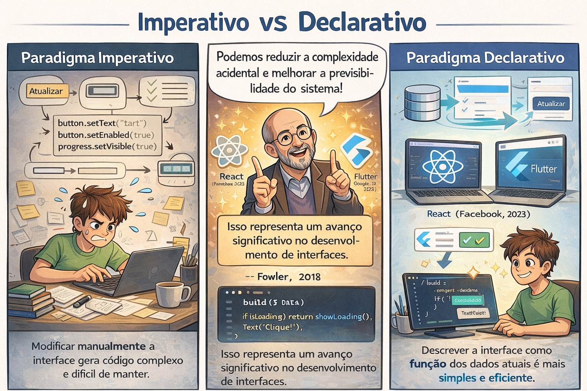
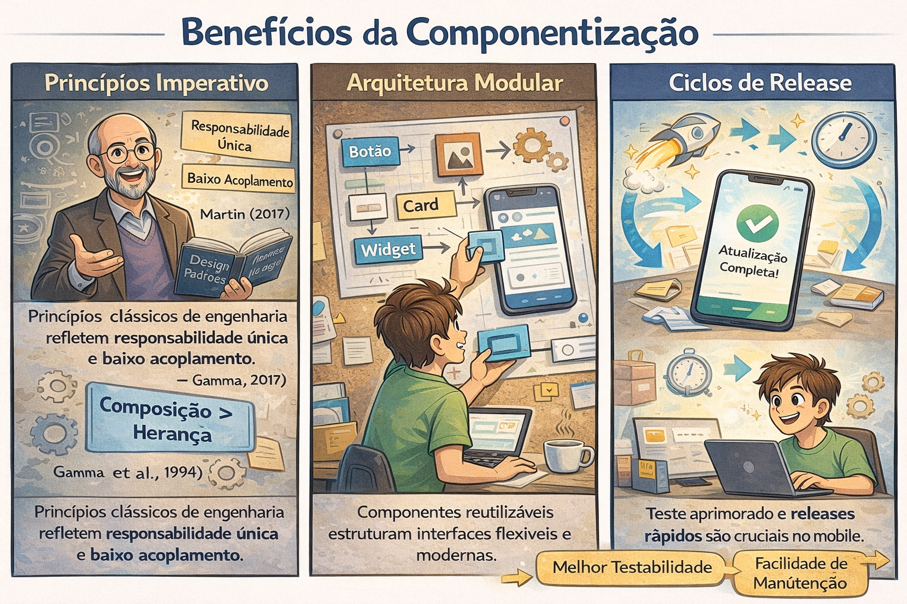
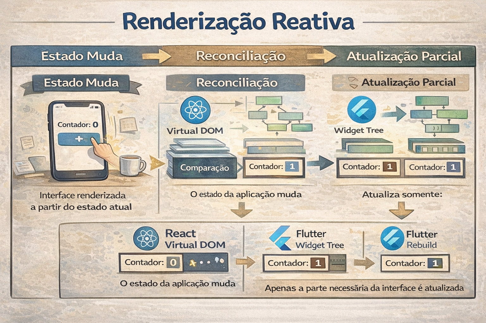
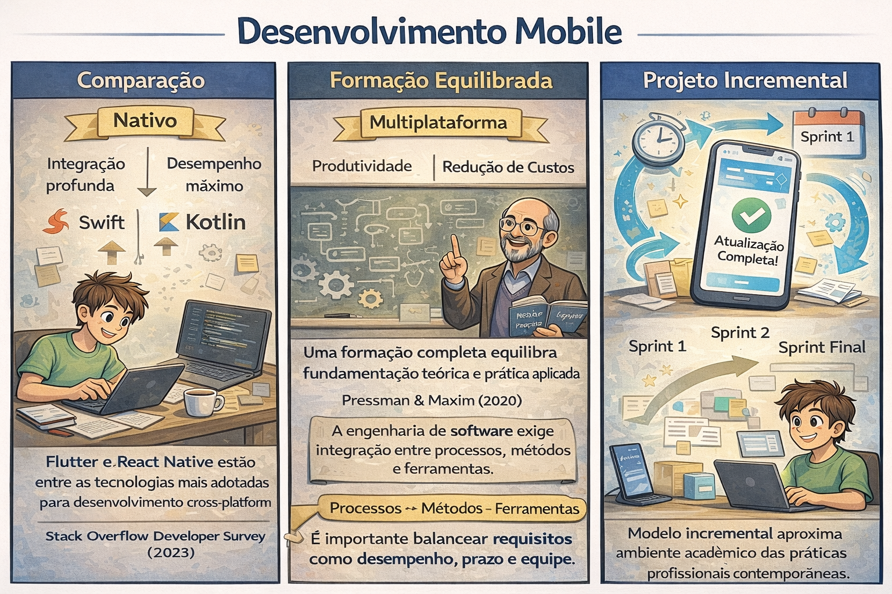

# Flutter para Iniciantes

Esta disciplina foi concebida para formar desenvolvedores capazes de construir aplicativos mobile reais, utilizando tecnologias modernas e amplamente adotadas pelo mercado. Nosso objetivo não é apenas aprender ferramentas, mas compreender os fundamentos que sustentam o desenvolvimento front-end mobile, permitindo que vocês construam soluções funcionais, organizadas e profissionalmente estruturadas. Ao longo do semestre, vocês irão desenvolver competências técnicas que vão desde a construção de interfaces até a integração com serviços externos, sempre com foco em qualidade e boas práticas.
A organização da disciplina foi planejada de forma progressiva e estruturada. Cada etapa foi pensada para construir conhecimento de maneira incremental: iniciaremos pelos fundamentos conceituais, avançaremos para práticas guiadas e, posteriormente, aplicaremos esse conhecimento na construção de um projeto completo. Os critérios de avaliação, as entregas e os objetivos de cada fase serão claramente definidos, garantindo transparência e previsibilidade no processo de aprendizagem.

Por fim, esta é uma jornada colaborativa. O desenvolvimento de software é uma atividade prática e interativa, e o aprendizado ocorre de forma mais consistente quando há participação ativa, questionamento e experimentação. Vamos construir juntos: vocês como protagonistas do próprio aprendizado e eu como orientador técnico nesse processo. O compromisso com dedicação, organização e prática constante será o diferencial para que, ao final da disciplina, cada um de vocês tenha desenvolvido um aplicativo funcional e adquirido competências reais para o mercado.

## Contextualização Histórica e Tecnológica
O desenvolvimento mobile consolidou-se como um dos eixos centrais da engenharia de software contemporânea. A popularização dos smartphones após o lançamento do iPhone em 2007 e a expansão do ecossistema Android transformaram profundamente a arquitetura das aplicações distribuídas. Segundo Sommerville (2016), a evolução das plataformas móveis exigiu adaptações nos modelos tradicionais de engenharia de software, especialmente no que se refere à experiência do usuário, restrições de hardware e conectividade intermitente.

A computação móvel introduz variáveis que não eram predominantes em sistemas desktop, como limitação energética, fragmentação de dispositivos e necessidade de respostas em tempo quase real. Essas características impactam diretamente decisões arquiteturais e estratégias de otimização.

## Paradigma Declarativo e Engenharia de Interfaces
O paradigma declarativo representa uma evolução significativa em relação ao modelo imperativo tradicional. Em vez de manipular explicitamente o estado da interface, o desenvolvedor descreve o resultado esperado com base nos dados atuais. Fowler (2018) descreve esse modelo como uma forma de reduzir complexidade acidental e melhorar previsibilidade do sistema.

Frameworks modernos como React (Facebook, 2023) e Flutter (Google, 2023) adotam esse paradigma, estruturando a interface como função do estado. Essa abordagem aproxima o desenvolvimento de interfaces de princípios funcionais, favorecendo imutabilidade e fluxo unidirecional de dados.

## Componentização e Princípios de Design de Software
A componentização encontra respaldo em princípios clássicos de engenharia de software, como responsabilidade única e baixo acoplamento, descritos por Martin (2017). Interfaces estruturadas em componentes reutilizáveis refletem também padrões de projeto discutidos por Gamma et al. (1994), especialmente no que se refere à composição sobre herança.

A arquitetura modular melhora testabilidade, facilita manutenção e reduz impacto de mudanças. Em ambientes mobile, onde atualizações são frequentes e ciclos de release são curtos, essa característica torna-se ainda mais relevante.

## Gerenciamento de Estado e Fluxo Unidirecional de Dados
O conceito de estado é central em aplicações reativas. Segundo a documentação oficial do React (Meta, 2023), o estado representa dados mutáveis que influenciam a renderização de componentes. O fluxo unidirecional de dados contribui para previsibilidade, pois estabelece que mudanças propagam-se de cima para baixo na árvore de componentes.

Em Flutter, o gerenciamento de estado pode assumir diferentes estratégias, como Provider, Riverpod ou BLoC, cada uma fundamentada em princípios de separação de responsabilidades e reatividade controlada (Google, 2023).

## Renderização Reativa e Eficiência
A renderização reativa baseia-se em mecanismos de reconciliação que atualizam apenas partes necessárias da interface. No caso do React, utiliza-se o Virtual DOM como estratégia de comparação eficiente (Facebook, 2023). Já o Flutter emprega um mecanismo próprio de reconstrução de widgets altamente otimizado por meio do engine Skia.

Essas estratégias reduzem custo computacional e contribuem para desempenho consistente, fator crítico em dispositivos com recursos limitados.

## Usabilidade e Experiência do Usuário
A experiência do usuário (UX) constitui dimensão essencial do desenvolvimento mobile. Nielsen (1994) estabelece heurísticas de usabilidade que permanecem relevantes, como visibilidade do status do sistema e consistência. Krug (2014) reforça o princípio da simplicidade cognitiva: interfaces devem exigir o mínimo esforço mental do usuário.

Diretrizes oficiais como o Material Design (Google, 2023) e o Human Interface Guidelines (Apple, 2023) consolidam padrões visuais e comportamentais que orientam desenvolvimento profissional.

## Arquitetura Mobile e Integração com APIs
Aplicações mobile modernas operam em arquiteturas distribuídas, consumindo serviços por meio de APIs REST ou GraphQL. Fielding (2000), ao definir o estilo arquitetural REST, estabelece princípios que orientam comunicação cliente-servidor baseada em recursos.

A correta implementação de requisições assíncronas, tratamento de erros e sincronização de dados é parte fundamental da engenharia de aplicações móveis.

## Abordagens Nativa e Multiplataforma
O desenvolvimento nativo oferece integração profunda e desempenho máximo, enquanto soluções multiplataforma priorizam produtividade e redução de custos. Segundo relatórios da Stack Overflow Developer Survey (2023), Flutter e React Native figuram entre as tecnologias mais adotadas para desenvolvimento mobile cross-platform.

A escolha entre abordagens deve considerar requisitos de desempenho, prazo, equipe e contexto organizacional.

A formação em desenvolvimento mobile deve equilibrar fundamentação teórica e prática aplicada. Conforme Pressman & Maxim (2020), a engenharia de software exige integração entre processos, métodos e ferramentas.

O projeto proposto nesta disciplina segue modelo incremental, aproximando o ambiente acadêmico das práticas profissionais contemporâneas.

## Referências

APPLE. Human Interface Guidelines. Cupertino: Apple Inc., 2023.

FACEBOOK (META). React Documentation. 2023. Disponível em: https://react.dev/

FIELDING, Roy. Architectural Styles and the Design of Network-based Software Architectures. Doctoral Dissertation, University of California, Irvine, 2000.

FOWLER, Martin. Refactoring: Improving the Design of Existing Code. 2. ed. Addison-Wesley, 2018.

GAMMA, Erich et al. Design Patterns: Elements of Reusable Object-Oriented Software. Addison-Wesley, 1994.

GOOGLE. Flutter Documentation. 2023. Disponível em: https://docs.flutter.dev/

GOOGLE. Material Design Guidelines. 2023. Disponível em: https://m3.material.io/

KRUG, Steve. Don't Make Me Think. 3. ed. New Riders, 2014.

MARTIN, Robert C. Clean Architecture. Prentice Hall, 2017.

NIELSEN, Jakob. Usability Engineering. Morgan Kaufmann, 1994.

PRESSMAN, Roger; MAXIM, Bruce. Software Engineering: A Practitioner's Approach. 9. ed. McGraw-Hill, 2020.

SOMMERVILLE, Ian. Software Engineering. 10. ed. Pearson, 2016.

STACK OVERFLOW. Developer Survey 2023. Disponível em: https://survey.stackoverflow.co/2023/

