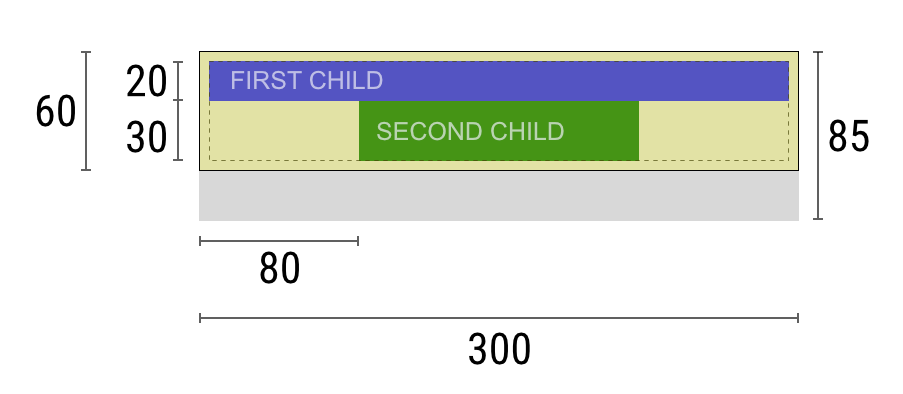
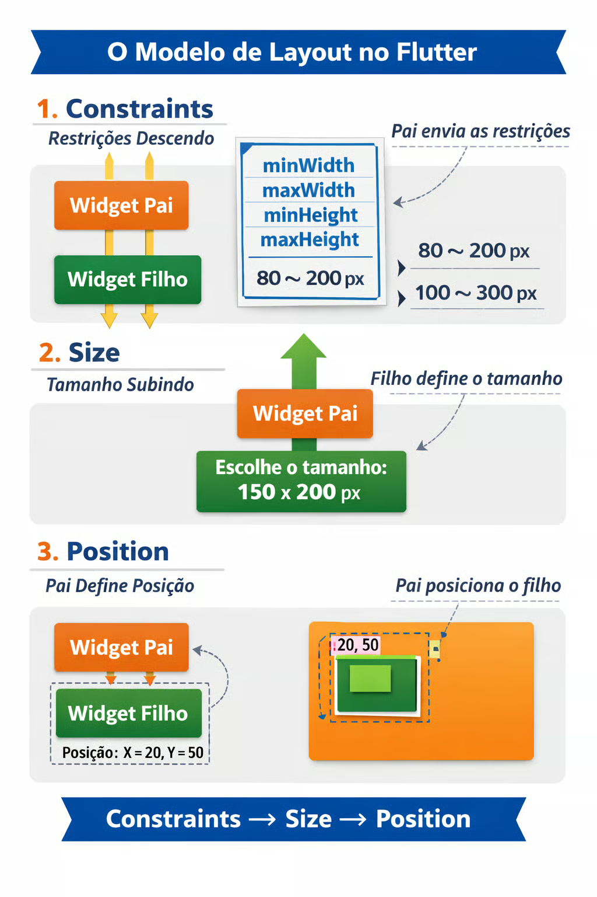

#### Constraints 

O layout de interfaces no Flutter é determinado por um mecanismo chamado Box Constraints, responsável por definir como cada widget calcula seu tamanho e posição na tela.

Diferentemente de sistemas baseados em fluxo automático (como CSS com comportamento implícito), o Flutter utiliza um modelo explícito de restrições entre widgets.

Esse modelo pode ser resumido na regra central:

:::tip
Constraints go down, sizes go up, parent sets position.
:::

Ou seja:

- as restrições descem,
- os tamanhos sobem,
- e o pai define a posição.

O widget pai não solicita diretamente o tamanho desejado pelo filho. Em vez disso, ele envia um conjunto de restrições dentro das quais o filho deve escolher seu tamanho, esse intervalo é representado por quatro valores:

- **minWidth**
- **maxWidth**
- **minHeight**
- **maxHeight**

O filho obrigatoriamente deve escolher um tamanho que esteja dentro desse intervalo. Ele não pode ultrapassar as restrições recebidas.

Isso significa que, no Flutter, **o pai controla o espaço disponível**, enquanto o filho apenas escolhe um tamanho válido dentro desse espaço.

Após receber as constraints, o filho calcula seu tamanho e devolve essa informação ao pai. Somente depois disso o pai decide onde posicionar o filho dentro de sua própria área. O processo de layout ocorre em três etapas:

1️⃣ O widget pai envia constraints ao filho.  
2️⃣ O filho escolhe um tamanho válido dentro dessas constraints.  
3️⃣ O pai posiciona o filho dentro de sua própria área.

Esse fluxo percorre a árvore de widgets **de cima para baixo (constraints)** e depois **de baixo para cima (sizes)**.

### Exemplo visual de constraints

A imagem abaixo ilustra esse processo. O widget pai define uma área máxima disponível (300 de largura e 85 de altura). Dentro dessas restrições, os filhos escolhem seus próprios tamanhos. O primeiro filho ocupa toda a largura disponível no topo, enquanto o segundo filho ocupa apenas parte da largura e é posicionado dentro da área permitida pelo pai.

Fonte: https://docs.flutter.dev/ui/layout/constraints

Nesse exemplo podemos observar claramente o funcionamento do sistema de constraints:

- O widget pai define a área disponível (300 de largura).
- O primeiro filho ocupa toda a largura permitida.
- O segundo filho escolhe um tamanho menor (80 de largura).
- Ambos devem respeitar os limites impostos pelo pai.

Observe que os filhos **não definem livremente seu tamanho**. Eles sempre escolhem um tamanho **dentro das restrições recebidas**.

Esse exemplo ilustra exatamente o princípio fundamental do Flutter:

- o pai controla o espaço disponível,
- o filho responde dentro desse espaço,
- e o posicionamento final é responsabilidade do pai.

Esse fluxo é sempre recursivo e percorre a árvore de widgets de cima para baixo e depois de baixo para cima.

Esse modelo explica vários comportamentos que, à primeira vista, parecem erros misteriosos. Por exemplo, quando um ListView é colocado dentro de um Column sem Expanded, ocorre o erro de “altura não limitada”. Isso acontece porque o Column fornece uma constraint com altura infinita (ou não restrita) para seus filhos, e o ListView não consegue determinar seu tamanho dentro desse cenário. Ele precisa de um limite máximo para funcionar corretamente.

Portanto, o problema não é o ListView em si, mas a ausência de uma restrição bem definida no eixo vertical.

Outro ponto importante é que widgets como Expanded e Flexible não alteram o tamanho diretamente; eles alteram as constraints enviadas pelo pai aos filhos. Expanded, por exemplo, força o pai (Row ou Column) a distribuir o espaço restante e enviar uma constraint com tamanho máximo fixado proporcionalmente ao valor de flex. Assim, o comportamento visual é consequência da manipulação das restrições.

O modelo de constraints também explica por que o Flutter é altamente previsível. Não há “layout mágico”. Cada widget recebe limites claros e responde dentro desses limites. Isso torna o sistema robusto, mas exige que o desenvolvedor compreenda como as restrições estão sendo propagadas.

Em termos arquiteturais, pode-se afirmar que o motor de layout do Flutter é um sistema de resolução hierárquica de restrições, onde cada nó da árvore participa do cálculo de tamanho e posicionamento.

Dominar constraints significa entender:
- Por que ocorre overflow
- Quando usar Expanded
- Quando usar SizedBox
- Por que certos widgets precisam de tamanho explícito
- Como evitar conflitos de layout

Em síntese, constraints não são apenas um detalhe técnico; elas constituem o núcleo do mecanismo de renderização do Flutter. Todo comportamento visual deriva diretamente desse fluxo de imposição e resolução de restrições.

:::tip
Regra prática para desenvolvedores Flutter

Sempre pergunte:

1. Quais constraints estou recebendo?
2. Qual tamanho posso escolher?
3. Quem vai posicionar este widget?
:::

