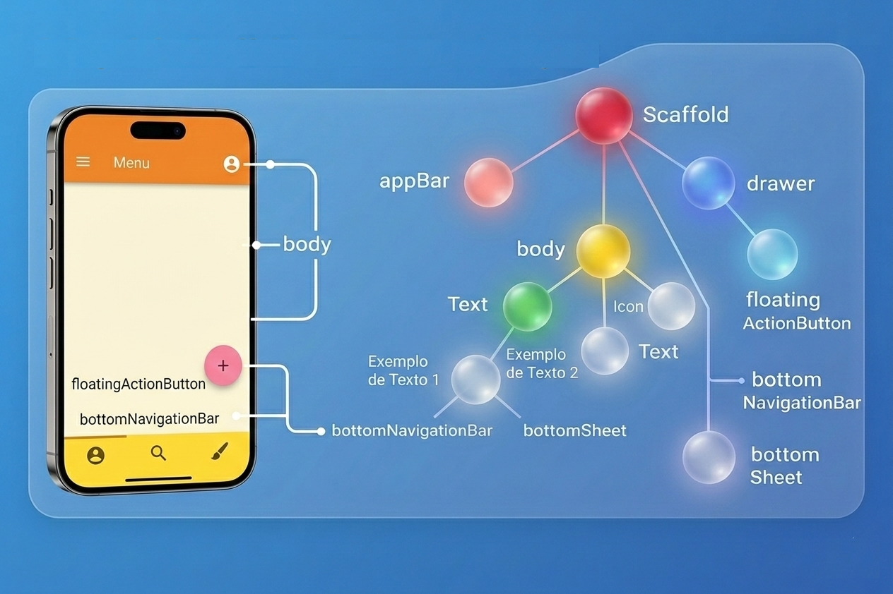

#### Ponto de Entrada da Aplicação

O código inicia com a importação do pacote material.dart, que disponibiliza todos os componentes visuais baseados no Material Design. Essa biblioteca contém widgets estruturais (Scaffold, AppBar), componentes interativos (FloatingActionButton, BottomNavigationBar) e elementos de layout.
A função main() é o ponto de entrada da aplicação Flutter. Toda aplicação Dart começa por ela. Dentro dessa função, chamamos runApp(), que inicializa o framework Flutter e injeta o widget raiz na árvore de widgets.

runApp() cria a árvore inicial de widgets e conecta o framework Flutter ao widget raiz da aplicação.
```dart
import 'package:flutter/material.dart';

void main() {
  runApp(const MyApp());
}
```

No Flutter, praticamente toda a interface é composta por widgets. Botões, textos, layouts, ícones e até mesmo espaçamentos são representados por widgets organizados em uma árvore hierárquica.

A classe MyApp herda de StatelessWidget, StatelessWidget não possui estado interno mutável. Isso significa que o widget não armazena dados que mudam ao longo do tempo, embora ele possa ser reconstruído sempre que o Flutter atualizar a árvore de widgets.
O método build() é obrigatório em widgets e define como a interface será construída. Ele retorna um MaterialApp, que é responsável por:
- Configuração de tema
- Gerenciamento de rotas
- Estrutura base do aplicativo

debugShowCheckedModeBanner: é a propriedade responsável por controlar o selo DEBUG, se seu valor for false remove o selo “DEBUG” do canto superior direito, se for true mantém o sele no canto superior direito. 
home: define o widget inicial da aplicação, que neste caso é ExemploScaffold.

```dart
Classe MyApp — Configuração Global da Aplicação
class MyApp extends StatelessWidget {
  const MyApp({super.key});

  @override
  Widget build(BuildContext context) {
    return const MaterialApp(
      debugShowCheckedModeBanner: false,
      home: ExemploScaffold(),
    );
  }
}
```

#### Classe ExemploScaffold — Estrutura Principal da Tela

```dart
class ExemploScaffold extends StatelessWidget {
  const ExemploScaffold({super.key});
```

Essa classe também herda de StatelessWidget, pois sua estrutura é fixa, e representa a tela principal da aplicação, já o método build() retorna um Scaffold, que organiza a estrutura da UI

```dart 
return Scaffold(
```

O Scaffold é o layout base do Material Design no Flutte, organizando a tela em áreas funcionais:


```dart 
appBar: AppBar(
  backgroundColor: Colors.blue.shade400,
  centerTitle: true,
  title: const Text(
    "APP BAR\n( Topo da Tela )",
    textAlign: TextAlign.center,
  ),
  leading: const Icon(Icons.menu),
  actions: const [
    Padding(
      padding: EdgeInsets.only(right: 16),
      child: Icon(Icons.more_vert),
    ),
  ],
),
```

A AppBar é o componente que ocupa o topo da tela.

backgroundColor define a cor.

centerTitle centraliza o título.

title é o texto principal.

leading é o ícone à esquerda (menu).

actions são os widgets posicionados à direita.

O Padding cria espaçamento interno para o ícone.

Conceitualmente, a AppBar organiza identidade e ações principais da tela.

Body — Área Principal de Conteúdo

```dart
body: Container(
  width: double.infinity,
  padding: const EdgeInsets.all(20),
  color: Colors.blue.shade100,
```

O body contém o conteúdo principal. Ele é envolvido por um Container, que:
- double.infinity faz o widget ocupar o máximo espaço permitido pelas restrições do widget pai.
- Aplica espaçamento interno (EdgeInsets)
- Define cor de fundo

Column — organiza seus filhos verticalmente.
```dart 
child: Column(
  children: [
```

SizedBox — Espaçamento
Em particular o TextStype é uma estilização do texto, atuando na centralização, tamanho da fonte e negrito 

```dart 
const SizedBox(height: 20),
SizedBox cria espaço vertical fixo.
Texto Principal
const Text(
  "BODY\nÁrea Principal de Conteúdo",
  textAlign: TextAlign.center,
  style: TextStyle(fontSize: 22, fontWeight: FontWeight.bold),
),
```


O Card representa um bloco visual elevado (Material Design), com as seguintes propriedades:
- borderRadius cria bordas arredondadas.
- side adiciona contorno.
- elevation gera sombra.

```dart 
Card(
  shape: RoundedRectangleBorder(
    borderRadius: BorderRadius.circular(20),
    side: const BorderSide(color: Colors.indigo, width: 2),
  ),
  elevation: 6,
```

Conteúdo Interno do Card onde temos: 
- ListTile organiza que organiza o icone à esquerda (leading) e Texto principal (title), sendo ideal para listas estruturadas.

```dart
child: const Padding(
  padding: EdgeInsets.all(20),
  child: Column(
    crossAxisAlignment: CrossAxisAlignment.start,
O Padding cria espaçamento interno.
crossAxisAlignment.start alinha o conteúdo à esquerda.
ListTile — Itens Estruturados
ListTile(
  leading: Icon(Icons.text_fields),
  title: Text("Textos"),
),
```

FloatingActionButton, o FAB representa a ação primária da tela sendo que, onPressed define comportamento, child é o ícone interno e onPressed que no momento, está vazio ({}).

```dart
floatingActionButton: FloatingActionButton(
  backgroundColor: Colors.red,
  onPressed: () {},
  child: const Icon(Icons.add),
),
```

BottomNavigationBar responsável po criar a navegação por abas inferiores, onde type.fixed mantém todos os itens visíveis, selectedItemColor define item ativo e unselectedItemColor define itens inativos. 

```dart 
bottomNavigationBar: BottomNavigationBar(
  backgroundColor: Colors.green.shade300,
  type: BottomNavigationBarType.fixed,
```


BottomSheet é uma área fixa inferior, onde height define altura, BoxDecoration aplica cor e bordas arredondadas superiores, Alignment.center centraliza conteúdo, funcionando como uma área complementar.

```dart 
bottomSheet: Container(
  height: 70,
  width: double.infinity,
``` 
:::tip
Este é o código completo


```dart 
import 'package:flutter/material.dart';

void main() {
  runApp(const MyApp());
}

class MyApp extends StatelessWidget {
  const MyApp({super.key});

  @override
  Widget build(BuildContext context) {
    return const MaterialApp(
      debugShowCheckedModeBanner: false,
      home: ExemploScaffold(),
    );
  }
}

class ExemploScaffold extends StatelessWidget {
  const ExemploScaffold({super.key});

  @override
  Widget build(BuildContext context) {
    return Scaffold(
      appBar: AppBar(
        backgroundColor: Colors.blue.shade400,
        centerTitle: true,
        title: const Text(
          "APP BAR\n( Topo da Tela )",
          textAlign: TextAlign.center,
        ),
        leading: const Icon(Icons.menu),
        actions: const [
          Padding(
            padding: EdgeInsets.only(right: 16),
            child: Icon(Icons.more_vert),
          ),
        ],
      ),

      body: Container(
        width: double.infinity,
        padding: const EdgeInsets.all(20),
        color: Colors.blue.shade100,
        child: Column(
          children: [
            const SizedBox(height: 20),
            const Text(
              "BODY\nÁrea Principal de Conteúdo",
              textAlign: TextAlign.center,
              style: TextStyle(fontSize: 22, fontWeight: FontWeight.bold),
            ),
            const SizedBox(height: 20),
            Card(
              shape: RoundedRectangleBorder(
                borderRadius: BorderRadius.circular(20),
                side: const BorderSide(color: Colors.indigo, width: 2),
              ),
              elevation: 6,
              child: const Padding(
                padding: EdgeInsets.all(20),
                child: Column(
                  crossAxisAlignment: CrossAxisAlignment.start,
                  children: [
                    Text(
                      "Aqui ficam:",
                      style: TextStyle(
                        fontSize: 18,
                        fontWeight: FontWeight.bold,
                      ),
                    ),
                    SizedBox(height: 10),
                    ListTile(
                      leading: Icon(Icons.text_fields),
                      title: Text("Textos"),
                    ),
                    ListTile(leading: Icon(Icons.list), title: Text("Listas")),
                    ListTile(leading: Icon(Icons.edit), title: Text("Forms")),
                    ListTile(
                      leading: Icon(Icons.dashboard),
                      title: Text("Layouts"),
                    ),
                  ],
                ),
              ),
            ),
          ],
        ),
      ),

      floatingActionButton: FloatingActionButton(
        backgroundColor: Colors.red,
        onPressed: () {},
        child: const Icon(Icons.add),
      ),

      bottomNavigationBar: BottomNavigationBar(
        backgroundColor: Colors.green.shade300,
        type: BottomNavigationBarType.fixed,
        selectedItemColor: Colors.black,
        unselectedItemColor: Colors.black54,
        items: const [
          BottomNavigationBarItem(icon: Icon(Icons.home), label: "Home"),
          BottomNavigationBarItem(
            icon: Icon(Icons.favorite),
            label: "Favoritos",
          ),
          BottomNavigationBarItem(icon: Icon(Icons.settings), label: "Config"),
        ],
      ),

      bottomSheet: Container(
        height: 70,
        width: double.infinity,
        decoration: const BoxDecoration(
          color: Colors.black87,
          borderRadius: BorderRadius.vertical(top: Radius.circular(20)),
        ),
        alignment: Alignment.center,
        child: const Text(
          "BOTTOM SHEET\n( Área Adicional Inferior )",
          textAlign: TextAlign.center,
          style: TextStyle(color: Colors.white, fontWeight: FontWeight.bold),
        ),
      ),
    );
  }
}
```

::: 


