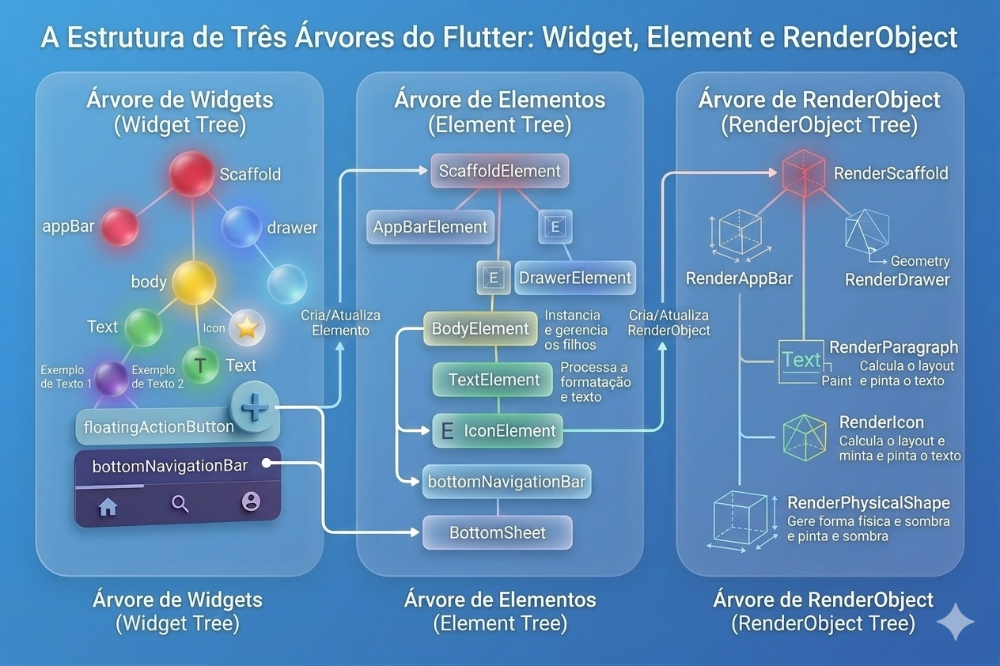
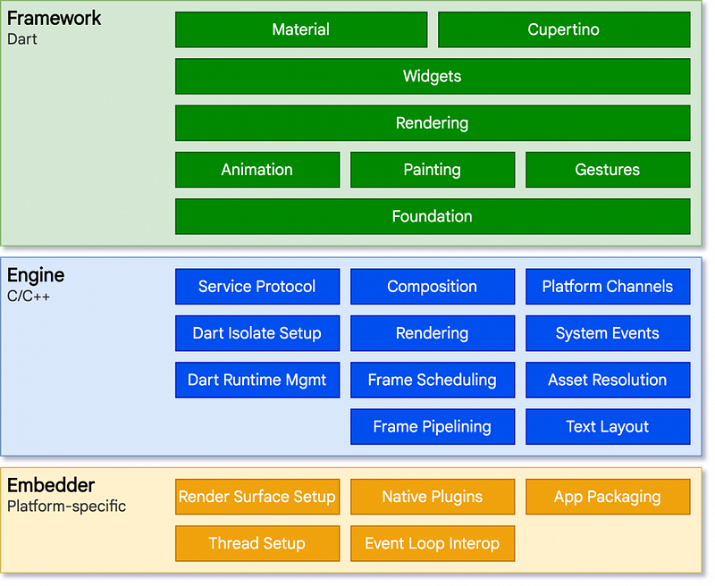

## Introdução
O Flutter é um framework de desenvolvimento multiplataforma criado pelo Google que permite construir aplicações para Android, iOS, Web e Desktop a partir de uma única base de código. Diferentemente de frameworks híbridos tradicionais, o Flutter não utiliza componentes nativos do sistema operacional para renderizar a interface. Ele possui seu próprio motor gráfico, baseado na biblioteca Skia, responsável por desenhar diretamente cada pixel na tela.

Essa decisão arquitetural garante consistência visual entre plataformas e reduz dependência das variações de implementação nativa. Segundo a documentação oficial do Flutter (Google, 2023), essa abordagem permite alto desempenho e controle preciso sobre layout e animações.

### Como o Flutter Renderiza a Interface
Conforme apresentado no material base, o Flutter opera com três árvores sincronizadas:

#### Widget tree
Widgets são descrições imutáveis da interface. Eles representam configuração, não estado mutável.
Everything is a widget" — esse é o princípio fundamental do Flutter.

Exemplo simples:

```dart 
Text('Olá Flutter!');
```

#### Element tree
Elements formam uma árvore intermediária que conecta Widgets (imutáveis) aos RenderObjects (mutáveis).
Eles são responsáveis por:
- Gerenciar ciclo de vida
- Preservar estado
- Decidir quando atualizar RenderObjects

O desenvolvedor raramente interage diretamente com Elements, mas eles são centrais para a eficiência do framework.

#### RenderObject tree
RenderObjects realizam o trabalho pesado:
- Layout: cálculo de tamanho e posição
- Paint: desenho dos pixels
- Hit Testing: detecção de interações

Diferente dos Widgets, RenderObjects são mutáveis e mais custosos. O Flutter reutiliza-os sempre que possível.
Esse processo é detalhada na documentação oficial do Flutter: https://docs.flutter.dev/resources/architectural-overview



#### Dart Essencial para Flutter
Flutter utiliza a linguagem Dart, que combina tipagem estática com sintaxe moderna.
Variáveis: 
```dart 
var, final e const
var nome = 'Flutter';
nome = 'Dart'; // permitido

final hora = DateTime.now();
// hora = DateTime.now(); // erro

const pi = 3.14159265;
```

- var → mutável
- final → imutável em tempo de execução
- const → constante em tempo de compilação

Referência oficial: https://dart.dev/language/variables

#### Funções em Dart
Dart trata funções como objetos de primeira classe.
```dart 
String saudar(String nome) {
  return 'Olá, $nome!';
}
```

Arrow function:
```dart 
String saudar(String nome) => 'Olá, $nome!';
Muito utilizadas em callbacks e builders.
```
Referência: https://dart.dev/language/functions

#### Classes

Flutter é fortemente orientado a objetos.
```dart
class Usuario {
  String nome;
  int idade;

  Usuario(this.nome, this.idade);

  void apresentar() {
    print('Olá, sou $nome');
  }
}
```

Referência:https://dart.dev/language/classes

#### main() e runApp()
Todo aplicativo Flutter começa com:
```dart
void main() {
  runApp(MeuApp());
}
```
runApp() inicializa o framework e injeta o widget raiz na árvore. O widget raiz geralmente é MaterialApp ou CupertinoApp.

Referência:https://api.flutter.dev/flutter/widgets/runApp.html

#### StatelessWidget vs StatefulWidget
StatelessWidget

Usado quando a UI não depende de estado mutável.
```dart
class Saudacao extends StatelessWidget {
  final String nome;

  Saudacao({required this.nome});

  @override
  Widget build(BuildContext context) {
    return Text('Olá, $nome!');
  }
}
```
:::tip
Características:

- Imutável
- Simples
- Fácil de testar
- Melhor performance
::: 

#### StatefulWidget

Usado quando há estado que muda ao longo do tempo.
```dart 
class Contador extends StatefulWidget {
  @override
  _ContadorState createState() => _ContadorState();
}

class _ContadorState extends State<Contador> {
  int _numero = 0;

  void _incrementar() {
    setState(() {
      _numero++;
    });
  }

  @override
  Widget build(BuildContext context) {
    return Column(
      children: [
        Text('Contador: $_numero'),
        ElevatedButton(
          onPressed: _incrementar,
          child: Text('Incrementar'),
        ),
      ],
    );
  }
}
```

#### setState()

setState() informa ao Flutter que o estado interno mudou e que o widget precisa ser reconstruído.

:::tip
Regras importantes:

- Modificações devem ocorrer dentro do callback do setState()
- Fora dele, a UI não será reconstruída

Referência:https://api.flutter.dev/flutter/widgets/State/setState.html
:::

:::tip
Quando Usar Cada Tipo?

Regra prática:
Comece com StatelessWidget

Converta para StatefulWidget apenas se houver:

- Interatividade
- Formulários
- Animações
- Dados que mudam ao longo do tempo

Essa abordagem reduz complexidade acidental.
:::

#### Arquitetura do Flutter 

A arquitetura do Flutter pode ser compreendida como um sistema organizado em três camadas principais: **Framework**, **Engine** e **Embedder**. Essa organização em níveis permite separar responsabilidades e garantir que o desenvolvimento da aplicação seja realizado de forma produtiva, enquanto as camadas inferiores cuidam da execução eficiente e da integração com o sistema operacional.

A camada superior é o **Flutter Framework**, desenvolvido principalmente em **Dart**. É nessa camada que os desenvolvedores constroem suas aplicações. O framework oferece um conjunto de bibliotecas e componentes que permitem descrever a interface do usuário de forma declarativa. Entre essas bibliotecas estão **Material** e **Cupertino**, que implementam os sistemas de design utilizados respectivamente no Android e no iOS. Abaixo dessas bibliotecas estão os **Widgets**, que constituem os elementos fundamentais da interface. Cada parte da tela é construída por meio da composição de widgets, formando uma estrutura hierárquica que representa a interface completa da aplicação.

O framework também inclui outros módulos importantes que dão suporte ao funcionamento da interface. A camada de **Rendering** é responsável por organizar como os elementos visuais são posicionados e exibidos na tela. Já os módulos de **Animation**, **Painting** e **Gestures** oferecem suporte para animações, desenho gráfico e detecção de interações do usuário, como toques e gestos. Na base do framework encontra-se a camada **Foundation**, que fornece utilidades essenciais, como estruturas de dados, gerenciamento de estado e ferramentas que são utilizadas por todas as partes do sistema.

Abaixo do framework está o **Flutter Engine**, implementado principalmente em **C e C++**. Essa camada executa as tarefas de baixo nível necessárias para que a interface descrita no framework possa ser renderizada na tela. O engine contém o sistema de **renderização gráfica**, o gerenciamento do **runtime do Dart**, o agendamento de quadros da interface (**frame scheduling**) e o processamento de eventos vindos do sistema operacional. Ele também inclui mecanismos como **frame pipelining**, **text layout** e **asset resolution**, que permitem organizar o fluxo de renderização, processar textos e carregar recursos da aplicação.

Um componente importante presente no engine é o suporte aos **Platform Channels**, que permitem que o código Dart se comunique com funcionalidades nativas do sistema operacional. Isso possibilita, por exemplo, acessar câmera, sensores, sistema de arquivos ou serviços específicos da plataforma.

A camada inferior da arquitetura é chamada de **Embedder**, que é específica para cada plataforma. O embedder conecta o Flutter ao sistema operacional no qual a aplicação está sendo executada. Ele é responsável por configurar a superfície de renderização da aplicação (**render surface setup**), integrar **plugins nativos**, gerenciar **threads** e garantir a comunicação com o **event loop** do sistema. Além disso, o embedder também participa do processo de **empacotamento da aplicação**, permitindo que ela seja distribuída nas diferentes plataformas.

Essa separação em camadas permite que o Flutter ofereça uma experiência consistente em múltiplos sistemas operacionais. O desenvolvedor trabalha no nível do **framework**, descrevendo a interface com widgets e lógica em Dart. O **engine** cuida da execução e da renderização gráfica, enquanto o **embedder** garante a integração com o ambiente da plataforma. Dessa forma, a arquitetura do Flutter consegue combinar produtividade no desenvolvimento com alto desempenho na execução das aplicações.


Fonte:https://docs.flutter.dev/resources/architectural-overview

#### Principais Aprendizados
Flutter desenha cada pixel usando seu próprio motor gráfico

O Flutter possíu três árvores principais: Widget, Element e RenderObject

Dart é essencial para construção de UI

- StatelessWidget deve ser a escolha padrão
- StatefulWidget é usado quando há estado mutável

Referências

GOOGLE. Flutter Architectural Overview. 2023. https://docs.flutter.dev/resources/architectural-overview

GOOGLE. Flutter API Documentation. 2023. https://api.flutter.dev

DART TEAM. Dart Language Tour. 2023. https://dart.dev/guides/language/language-tour

FOWLER, Martin. Refactoring: Improving the Design of Existing Code. 2. ed. Addison-Wesley, 2018.

MARTIN, Robert C. Clean Architecture. Prentice Hall, 2017.

GAMMA, Erich et al. Design Patterns. Addison-Wesley, 1994.