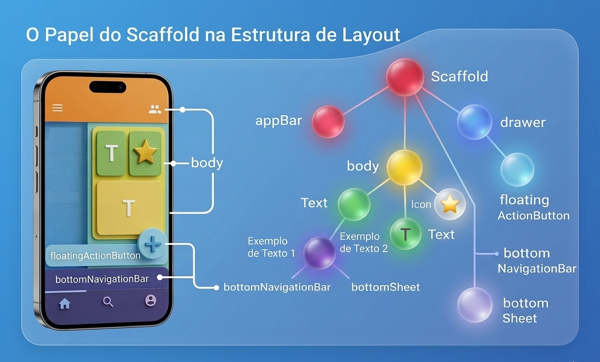

#### Layout parte 1

O Flutter utiliza um sistema de layout baseado em restrições (constraints-based layout), no qual cada widget recebe limitações de tamanho impostas por seu widget pai. Com base nessas restrições, o widget determina seu próprio tamanho e reporta esse tamanho de volta ao pai.Diferente de frameworks tradicionais que utilizam posicionamento absoluto ou sistemas baseados em DOM, o Flutter utiliza um mecanismo próprio onde cada widget recebe restrições de seu pai e decide seu tamanho dentro dessas restrições.

Segundo a documentação oficial do Flutter (Google, 2023), o layout segue uma regra simples:
:::tip
Constraints go down. Sizes go up. Parent sets position.
:::

Referência: https://docs.flutter.dev/development/ui/layout/constraints

### O Papel do Scaffold na Estrutura de Layout

O Scaffold fornece uma estrutura padrão de tela para aplicações Material Design, oferecendo regiões estruturais pré-definidas onde componentes podem ser posicionados em regiões pré-definidas:
- appBar
- drawer
- body
- floatingActionButton
- bottomNavigationBar
- bottomSheet
- persistentFooterButtons

O Scaffold é um widget estrutural do Material Design que organiza regiões funcionais da interface, facilitando a construção de telas consistentes. Referência: https://api.flutter.dev/flutter/material/Scaffold-class.html




#### Estrutura Base da Aplicação

A aplicação inicia com:
```dart
import 'package:flutter/material.dart';

void main() {
  runApp(const MyApp());
}

class MyApp extends StatelessWidget {
  const MyApp({super.key});

  @override
  Widget build(BuildContext context) {
    return const MaterialApp(
      debugShowCheckedModeBanner: false,
      home: ExemploScaffold(),
    );
  }
}
```

Conceitos envolvidos:
- MaterialApp configura o tema, navegação, rotas e localização
- home define o widget raiz.
- debugShowCheckedModeBanner remove a marca de debug.

Referência:https://api.flutter.dev/flutter/material/MaterialApp-class.html

O Scaffold é utilizado como layout principal, ele não é apenas um container — ele implementa o padrão visual do Material Design:
```dart
class ExemploScaffold extends StatelessWidget {
  const ExemploScaffold({super.key});

  @override
  Widget build(BuildContext context) {
    return Scaffold(
      // Estrutura definida aqui
    );
  }
}
```
#### Configuração do AppBar
```dart
appBar: AppBar(
  backgroundColor: Colors.deepPurple,
  centerTitle: true,
  title: const Text(
    "APP BAR\n(Topo da Tela)",
    textAlign: TextAlign.center,
  ),
  leading: const Icon(Icons.menu),
  actions: const [
    Padding(
      padding: EdgeInsets.only(right: 16),
      child: Icon(Icons.more_vert),
    ),
  ],
),
```
- Conceitos importantes:
- leading: elemento à esquerda
- actions: lista de widgets à direita
- centerTitle: centraliza título

Referência:https://api.flutter.dev/flutter/material/AppBar-class.html

#### Body: Container e Column

```dart 
body: Container(
  width: double.infinity,
  padding: const EdgeInsets.all(20),
  color: Colors.blue.shade100,
  child: Column(
    children: [
      const SizedBox(height: 20),
      const Text(
        "BODY\nÁrea Principal de Conteúdo",
        textAlign: TextAlign.center,
        style: TextStyle(fontSize: 22, fontWeight: FontWeight.bold),
      ),
      const SizedBox(height: 20),
      Card(...),
    ],
  ),
),
```
Elementos-chave:
- double.infinity faz o widget ocupar o máximo espaço disponível dentro das restrições impostas pelo pai.
- EdgeInsets define padding
- Column organiza filhos verticalmente
- SizedBox cria espaçamento

Referências:https://api.flutter.dev/flutter/widgets/Column-class.html, https://api.flutter.dev/flutter/widgets/Container-class.html

#### Card
O Card é configurado com bordas arredondadas e elevação:

```dart
Card(
  shape: RoundedRectangleBorder(
    borderRadius: BorderRadius.circular(20),
    side: BorderSide(color: Colors.indigo, width: 2),
  ),
  elevation: 6,
  child: Padding(
    padding: EdgeInsets.all(20),
    child: Column(
      crossAxisAlignment: CrossAxisAlignment.start,
      children: [
        Text("Aqui ficam:"),
        SizedBox(height: 10),
        ListTile(
          leading: Icon(Icons.text_fields),
          title: Text("Textos"),
        ),
      ],
    ),
  ),
)
```

Conceitos:
- elevation cria sombra (Material Design)
- RoundedRectangleBorder define borda
- ListTile organiza ícone + texto

Referência:https://api.flutter.dev/flutter/material/Card-class.html

#### FloatingActionButton

```dart
floatingActionButton: FloatingActionButton(
  backgroundColor: Colors.red,
  onPressed: () {},
  child: const Icon(Icons.add),
),
```
O FAB é um padrão do Material Design para ações primárias, Referência:https://api.flutter.dev/flutter/material/FloatingActionButton-class.html

#### BottomNavigationBar
```dart 
bottomNavigationBar: BottomNavigationBar(
  backgroundColor: Colors.green.shade300,
  type: BottomNavigationBarType.fixed,
  selectedItemColor: Colors.black,
  unselectedItemColor: Colors.black54,
  items: const [
    BottomNavigationBarItem(
      icon: Icon(Icons.home),
      label: "Home",
    ),
  ],
),
```

Conceitos, navegação por abas inferiores
- BottomNavigationBarType.fixed
- Controle visual de item selecionado

Referência: https://api.flutter.dev/flutter/material/BottomNavigationBar-class.html

#### BottomSheet
```dart
bottomSheet: Container(
  height: 70,
  width: double.infinity,
  decoration: const BoxDecoration(
    color: Colors.black87,
    borderRadius: BorderRadius.vertical(top: Radius.circular(20)),
  ),
  alignment: Alignment.center,
  child: const Text(
    "BOTTOM SHEET\n(Área Adicional Inferior)",
    textAlign: TextAlign.center,
  ),
),
```

O BottomSheet é usado para conteúdo complementar fixo ou modal, sendo de dois tipos Existem dois tipos Persistent Bottom Sheet e Modal Bottom Sheet, Referência: https://api.flutter.dev/flutter/material/BottomSheet-class.html

Referências

GOOGLE. Flutter Documentation. Acesso em: 2026. Flutter Layout Constraints.https://docs.flutter.dev/development/ui/layout/constraints

GOOGLE. Flutter Documentation. 2023. https://docs.flutter.dev

GOOGLE. Flutter API Reference. 2023. https://api.flutter.dev

GOOGLE. Material Design 3 Guidelines. 2023. https://m3.material.io

