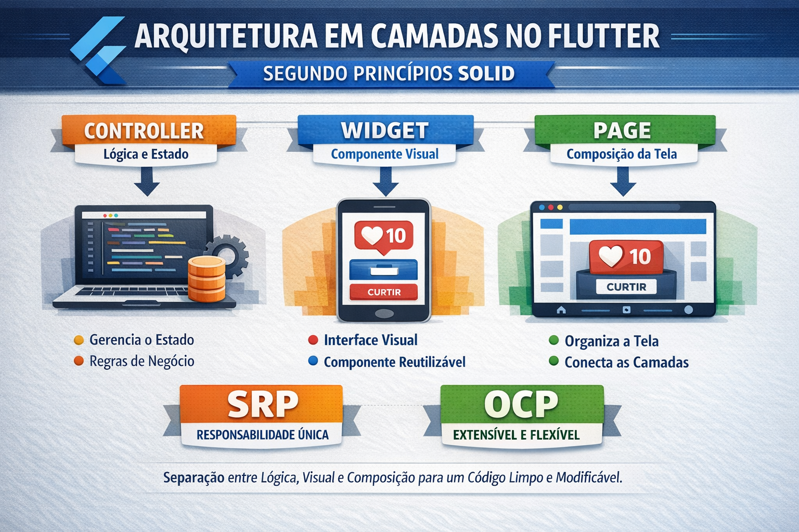

### Refatorando Stateful

A organização da aplicação em **camadas** é uma prática comum em engenharia de software, pois permite separar responsabilidades e reduzir o acoplamento entre as partes do sistema. No exemplo apresentado, a aplicação foi dividida em **três camadas principais: controller (lógica e estado), widgets (componentes visuais) e pages (composição da tela)**. Essa separação torna o código mais organizado, facilita manutenção e permite evolução da aplicação sem que mudanças em uma parte provoquem efeitos inesperados em outras.

A **camada de controller** é responsável por gerenciar o **estado da aplicação e a lógica de comportamento**. No exemplo, o `LikeController` mantém o valor de curtidas e define o método que altera esse valor. Essa camada não possui nenhum conhecimento sobre interface gráfica, cores ou layout. Sua única função é manipular dados e notificar quando o estado muda. Essa separação permite que a lógica seja reutilizada em diferentes telas ou widgets e também facilita testes automatizados, pois a lógica pode ser executada independentemente da interface.

A **camada de widgets** representa os **componentes visuais reutilizáveis** da interface. O `LikeCard`, por exemplo, é responsável apenas por desenhar o card que exibe o número de curtidas e o botão de interação. Esse componente recebe os dados e as ações como parâmetros, mas não conhece como esses dados são gerados ou armazenados. Dessa forma, o widget pode ser reutilizado em diferentes contextos da aplicação, bastando fornecer os valores necessários. Essa camada foca exclusivamente na apresentação visual e na interação com o usuário.

A **camada de pages** atua como uma **camada de composição da interface**. Ela organiza os widgets na tela, define estruturas maiores como `Scaffold`, `AppBar`, `BottomNavigationBar` e conecta os widgets ao controller responsável pelo estado. Em outras palavras, a página funciona como um ponto de integração entre a lógica da aplicação e os componentes visuais. Essa camada não implementa regras de negócio nem cria componentes visuais complexos; sua função é estruturar a tela e coordenar a comunicação entre as outras camadas.

Essa divisão em camadas está diretamente relacionada ao princípio **Single Responsibility Principle (SRP)** do **SOLID**, que estabelece que cada classe deve possuir apenas uma responsabilidade bem definida. O controller cuida da lógica e do estado, o widget cuida da apresentação visual e a página cuida da composição da tela. Como cada elemento possui um papel específico, o código torna-se mais fácil de entender, modificar e evoluir.

Além disso, essa arquitetura favorece o princípio **Open/Closed Principle (OCP)**. Como os componentes estão desacoplados, é possível estender a aplicação sem modificar o código existente. Por exemplo, pode-se criar um novo widget para exibir curtidas de outra forma, ou um novo controller com regras diferentes, sem alterar a estrutura da página. Essa capacidade de extensão sem modificação reduz riscos de regressão e facilita a evolução do sistema.

Portanto, a utilização dessas três camadas não é apenas uma escolha organizacional, mas uma estratégia arquitetural alinhada aos princípios do **SOLID**. Ela promove modularidade, reutilização de componentes, redução de acoplamento e maior clareza estrutural, características fundamentais para o desenvolvimento de aplicações escaláveis e de fácil manutenção.



A imagem apresenta a **estrutura de diretórios do projeto Flutter após a refatoração**, organizada de acordo com um **modelo simples de arquitetura em camadas**. O objetivo dessa organização é separar as diferentes responsabilidades do sistema, evitando que toda a lógica da aplicação fique concentrada em um único arquivo.

Dentro da pasta **`lib`**, o código foi dividido em três camadas principais: **controllers**, **pages** e **widgets**. Essa divisão reflete a separação entre **lógica da aplicação, organização da tela e componentes visuais**, tornando a estrutura do projeto mais clara e modular.

A pasta **`controllers`** contém a lógica responsável por controlar o estado da aplicação. No exemplo, o arquivo `like_controller.dart` gerencia o número de curtidas e define as operações que alteram esse valor. Assim, a regra de funcionamento da aplicação fica isolada da interface gráfica.

A pasta **`widgets`** reúne os **componentes visuais reutilizáveis**. O arquivo `like_card.dart` representa um componente de interface responsável por exibir as curtidas e o botão de interação. Ele apenas apresenta dados recebidos e dispara eventos, sem implementar regras de negócio.

A pasta **`pages`** contém a **estrutura das telas da aplicação**. O arquivo `home_page.dart` organiza os widgets dentro do layout principal da tela e estabelece a conexão entre a lógica do controller e os componentes visuais.

:::imgtext assets/images/refatorando_less_ful.png

Por fim, o arquivo **`main.dart`** permanece como ponto de entrada da aplicação, responsável apenas por iniciar o aplicativo e definir a página inicial.

Essa estrutura evidencia uma organização modular do projeto, em que cada camada possui uma função específica, facilitando a leitura do código, a manutenção e a evolução da aplicação.

:::

Seguem os arquivo refatorados 

```dart
import 'package:flutter/material.dart';
import 'pages/home_page.dart';

void main() {
  runApp(const MyApp());
}

class MyApp extends StatelessWidget {
  const MyApp({super.key});

  @override
  Widget build(BuildContext context) {
    return MaterialApp(
      title: "Exemplo StateFulWidget",
      debugShowCheckedModeBanner: false,

      theme: ThemeData(
        colorScheme: ColorScheme.fromSeed(seedColor: Colors.blue),
      ),

      home: const HomePage(),
    );
  }
}

```

```dart
import 'package:flutter/material.dart';

class LikeCard extends StatelessWidget {
  final int likes;
  final VoidCallback onCurtir;

  const LikeCard({super.key, required this.likes, required this.onCurtir});

  @override
  Widget build(BuildContext context) {
    return Card(
      elevation: 6,
      margin: const EdgeInsets.all(20),

      child: Padding(
        padding: const EdgeInsets.all(25),

        child: Column(
          mainAxisSize: MainAxisSize.min,
          children: [
            const Icon(Icons.favorite, size: 50, color: Colors.red),
            const SizedBox(height: 10),
            const Text("Curtidas", style: TextStyle(fontSize: 20)),
            const SizedBox(height: 10),
            Text(
              "$likes",
              style: const TextStyle(fontSize: 36, fontWeight: FontWeight.bold),
            ),
            const SizedBox(height: 20),
            ElevatedButton(onPressed: onCurtir, child: const Text("Curtir")),
          ],
        ),
      ),
    );
  }
}

```

```dart
import 'package:flutter/material.dart';
import '../controllers/like_controller.dart';
import '../widgets/like_card.dart';

class HomePage extends StatefulWidget {
  const HomePage({super.key});

  @override
  State<HomePage> createState() => _HomePageState();
}

class _HomePageState extends State<HomePage> {
  final LikeController controller = LikeController();

  @override
  void initState() {
    super.initState();

    controller.addListener(() {
      setState(() {});
    });
  }

  @override
  Widget build(BuildContext context) {
    return Scaffold(
      appBar: AppBar(
        title: const Text("Exemplo StatefulWidget"),
        centerTitle: true,
        leading: const Icon(Icons.menu),

        actions: const [
          Padding(
            padding: EdgeInsets.symmetric(horizontal: 10),
            child: Icon(Icons.search),
          ),

          Padding(
            padding: EdgeInsets.symmetric(horizontal: 10),
            child: Icon(Icons.more_vert),
          ),
        ],
      ),

      body: Center(
        child: LikeCard(
          likes: controller.likes,
          onCurtir: controller.incrementar,
        ),
      ),

      floatingActionButton: FloatingActionButton(
        onPressed: controller.incrementar,
        child: const Icon(Icons.thumb_up),
      ),

      bottomNavigationBar: BottomAppBar(
        height: 60,

        child: Row(
          mainAxisAlignment: MainAxisAlignment.spaceAround,

          children: const [
            Icon(Icons.home),
            Icon(Icons.favorite),
            Icon(Icons.settings),
          ],
        ),
      ),
    );
  }
}

```

```dart
import 'package:flutter/material.dart';

class LikeController extends ChangeNotifier {
  int _likes = 0;

  int get likes => _likes;

  void incrementar() {
    _likes++;
    notifyListeners();
  }
}

```

