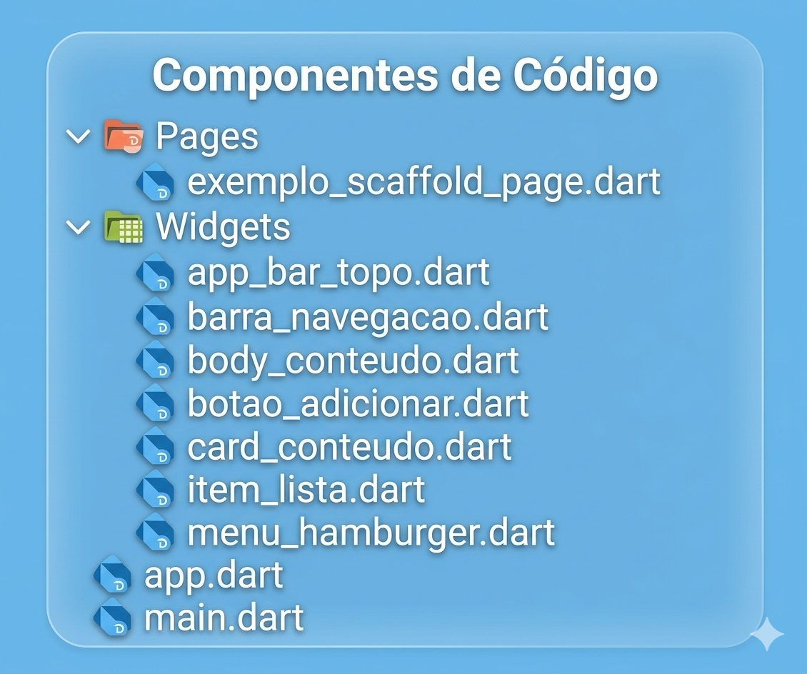
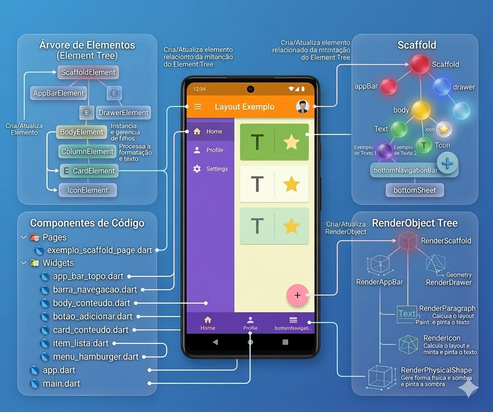

#### Refatoração do código 

A refatoração realizada no projeto teve como objetivo principal melhorar a **organização estrutural do código**, tornando-o mais **legível, modular e de fácil manutenção**. Em seu estado inicial, a aplicação possuía uma estrutura monolítica, na qual diversos elementos da interface — como `AppBar`, `Body`, `FloatingActionButton` e `BottomNavigationBar` — estavam implementados dentro de uma única classe. Embora esse tipo de abordagem funcione para exemplos simples ou protótipos, ela tende a gerar arquivos grandes, com múltiplas responsabilidades e difícil evolução ao longo do tempo. A refatoração buscou resolver esse problema por meio da **separação de responsabilidades e da composição de componentes**, princípios amplamente utilizados no desenvolvimento moderno de software.

O primeiro passo dessa refatoração foi a **separação do ponto de entrada da aplicação**. O arquivo `main.dart` passou a conter apenas a função `main()` e a chamada para `runApp()`. Dessa forma, sua única responsabilidade é iniciar a aplicação Flutter. Essa mudança está alinhada ao princípio **SRP (Single Responsibility Principle)** do SOLID, que afirma que uma classe ou módulo deve possuir apenas um motivo para mudar. Com essa separação, o arquivo de entrada deixa de conhecer detalhes de layout, widgets ou estrutura da interface, tornando o sistema mais organizado e fácil de compreender.

Na sequência, foi criado o arquivo `app.dart`, responsável por configurar o `MaterialApp`. Nesse ponto, a classe `MyApp` passa a cuidar exclusivamente da **configuração global da aplicação**, como tema, rotas e definição do widget inicial (`home`). Essa separação reforça novamente o **SRP**, pois `MyApp` não precisa conhecer a implementação interna da tela principal. Além disso, essa estrutura se aproxima do princípio **DIP (Dependency Inversion Principle)**, uma vez que a aplicação depende apenas da abstração `Widget`, e não de implementações específicas da interface.

A classe `ExemploScaffold`, localizada na pasta `pages`, representa outra etapa importante da refatoração. Antes, toda a estrutura visual da tela estava concentrada em um único arquivo. Após a refatoração, o `Scaffold` passou a atuar apenas como **compositor de componentes especializados**. Em vez de implementar diretamente a `AppBar`, o `Body`, o botão flutuante e a navegação inferior, ele apenas referencia widgets específicos para cada função. Esse modelo promove **baixo acoplamento e alta coesão**, dois objetivos fundamentais da engenharia de software. Além disso, ele atende ao princípio **OCP (Open/Closed Principle)**, pois novas implementações podem substituir partes da interface sem exigir alterações na estrutura do `Scaffold`.

Outro aspecto importante da refatoração foi a **extração de componentes especializados**. A `AppBar`, por exemplo, foi isolada no widget `AppBarTopo`. Essa mudança permite que o topo da aplicação seja reutilizado em diferentes telas e testado de forma independente. Para que esse componente funcione corretamente dentro do `Scaffold`, ele implementa a interface `PreferredSizeWidget`, que define explicitamente o tamanho da barra superior. Essa solução demonstra uma aplicação prática dos princípios **LSP (Liskov Substitution Principle)** e **ISP (Interface Segregation Principle)**, pois o widget implementa apenas a interface necessária e pode ser substituído por qualquer outro componente que respeite a mesma abstração.

O menu lateral (`Drawer`) também foi extraído para um widget próprio chamado `MenuHamburger`. Essa separação garante que toda a lógica e estrutura do menu fiquem encapsuladas em um único componente. Caso o menu precise evoluir — por exemplo, adicionando novas opções ou conectando-se a um sistema de navegação mais complexo — essas mudanças ocorrerão apenas nesse arquivo, sem impactar o restante da aplicação. Mais uma vez, observa-se a aplicação direta do **Single Responsibility Principle**.

O corpo principal da tela também foi modularizado através do widget `BodyConteudo`. Esse componente passou a ser responsável apenas pela organização do layout central da interface. Dentro dele, outro elemento foi extraído: o `CardConteudo`, que encapsula o bloco visual contendo textos e itens de lista. Essa abordagem evidencia o uso de **composição de widgets**, um dos conceitos mais importantes do Flutter. Em vez de criar estruturas grandes e difíceis de manter, a interface passa a ser formada por **pequenos componentes reutilizáveis**, cada um com uma responsabilidade bem definida.

A refatoração também introduziu um nível adicional de abstração ao criar o widget `ItemLista`, responsável por representar cada item exibido dentro do cartão. Antes, vários `ListTile` eram declarados repetidamente. Com a criação desse componente, foi possível reduzir duplicação de código e aumentar a reutilização. Esse processo está diretamente relacionado ao princípio **DRY (Don't Repeat Yourself)** e também reforça os princípios **SRP** e **OCP**, pois novos tipos de itens podem ser adicionados sem alterar a estrutura do cartão.

Outros elementos da interface, como a `BottomNavigationBar` e o `FloatingActionButton`, também foram transformados em componentes independentes (`BarraNavegacao` e `BotaoAdicionar`). Essa mudança permite que esses elementos evoluam de forma isolada, recebendo lógica adicional, estados ou animações sem modificar o `Scaffold`. Essa flexibilidade é um dos principais benefícios de uma arquitetura baseada em componentes.

Portanto, essa refatoração não se limitou a reorganizar arquivos ou dividir o código em múltiplos módulos. Ela representou uma **evolução arquitetural significativa**, transformando uma implementação monolítica em uma **arquitetura modular baseada em composição de widgets**. Ao aplicar princípios do **SOLID**, o código tornou-se mais claro, mais fácil de compreender e muito mais preparado para evolução futura. Esse tipo de abordagem é essencial em projetos reais, pois reduz complexidade, facilita manutenção e melhora a escalabilidade da aplicação.


A estrutura refatorada ficará assim:


main.dart — Separação do Ponto de Entrada
```dart 
import 'package:flutter/material.dart';
import 'app.dart';

void main() {
  runApp(const MyApp());
}
```

app.dart — Configuração Global da Aplicação
```dart 
class MyApp extends StatelessWidget {
  const MyApp({super.key});
  @override
  Widget build(BuildContext context) {
    return const MaterialApp(
      debugShowCheckedModeBanner: false,
      home: ExemploScaffold(),
    );
  }
}
```

pages/exemplo_scaffold_page.dart — Composição Estrutural
```dart 
import 'package:flutter/material.dart';
import 'package:layout_flutter_refatorado/widgets/app_bar_topo.dart';
import 'package:layout_flutter_refatorado/widgets/barra_navegacao.dart';
import 'package:layout_flutter_refatorado/widgets/body_conteudo.dart';
import 'package:layout_flutter_refatorado/widgets/botao_adicionar.dart';
import 'package:layout_flutter_refatorado/widgets/menu_hamburger.dart';

class ExemploScaffold extends StatelessWidget {
  const ExemploScaffold({super.key});

  @override
  Widget build(BuildContext context) {
    return Scaffold(
      appBar: AppBarTopo(),
      drawer: MenuHamburger(),
      body: BodyConteudo(),
      floatingActionButton: BotaoAdicionar(),
      bottomNavigationBar: BarraNavegacao(),
    );
  }
}
```

widgets/app_bar_topo.dart — Componente Especializado
```dart 
//******************************
//Topo do aplicativo
//
import 'package:flutter/material.dart';

class AppBarTopo extends StatelessWidget implements PreferredSizeWidget {
  const AppBarTopo({super.key});
  @override
  Widget build(BuildContext context) {
    return AppBar(
      backgroundColor: Colors.blue.shade400,
      centerTitle: true,
      title: const Text(
        "APP BAR (Titulo do topo)",
        textAlign: TextAlign.center,
      ),
      leading: IconButton(
        onPressed: () {
          Scaffold.of(context).openDrawer();
        },
        icon: Icon(Icons.menu),
      ),
      actions: const [
        Padding(
          padding: EdgeInsets.only(right: 16),
          child: Icon(Icons.more_vert),
        ),
      ],
    );
  }

  @override
  Size get preferredSize => const Size.fromHeight(kToolbarHeight);
}
´´´
:::tip 
Implementa PreferredSizeWidget
Essa implementação é necessária, pois o Scaffold exige que appBar tenha tamanho definido.
Size get preferredSize => const Size.fromHeight(kToolbarHeight);
::: 


widgets/menu_hamburger.dart — Responsabilidade Isolada
```dart 
import 'package:flutter/material.dart';

class MenuHamburger extends StatelessWidget {
  const MenuHamburger({super.key});
  @override
  Widget build(BuildContext context) {
    return Drawer(
      child: ListView(
        padding: EdgeInsets.zero,
        children: [
          const DrawerHeader(
            decoration: BoxDecoration(color: Colors.blue),
            child: Text(
              'Menu',
              style: TextStyle(color: Colors.white, fontSize: 20),
            ),
          ),
          ListTile(
            leading: const Icon(Icons.home),
            title: const Text('Home'),
            onTap: () {
              Navigator.pop(context); // fecha o menu
            },
          ),
          ListTile(
            leading: const Icon(Icons.settings),
            title: const Text('Configurações'),
            onTap: () {
              Navigator.pop(context);
            },
          ),
        ],
      ),
    );
  }
}
```

widgets/body_conteudo.dart — Corpo Modularizado
```dart 
//*************************
//corpo do aplicativo
//
import 'package:flutter/material.dart';
import 'package:layout_flutter_refatorado/widgets/card_conteudo.dart';

class BodyConteudo extends StatelessWidget {
  const BodyConteudo({super.key});
  @override
  Widget build(BuildContext context) {
    return Container(
      width: double.infinity,
      padding: const EdgeInsets.all(20),
      color: Colors.blue.shade100,
      child: Column(
        children: [
          const SizedBox(height: 20),
          const Text(
            "BODY\nÁrea Principal de Conteúdo",
            textAlign: TextAlign.center,
            style: TextStyle(fontSize: 22, fontWeight: FontWeight.bold),
          ),
          const SizedBox(height: 20),
          CardConteudo(),
        ],
      ),
    );
  }
}
```

widgets/card_conteudo.dart — Extração de Componente Complexo
```dart 
import 'package:flutter/material.dart';
import 'package:layout_flutter_refatorado/widgets/item_lista.dart';

class CardConteudo extends StatelessWidget {
  const CardConteudo({super.key});
  @override
  Widget build(BuildContext context) {
    return Card(
      shape: RoundedRectangleBorder(
        borderRadius: BorderRadius.circular(20),
        side: const BorderSide(color: Colors.indigo, width: 2),
      ),
      elevation: 6,
      child: const Padding(
        padding: EdgeInsets.all(20),
        child: Column(
          crossAxisAlignment: CrossAxisAlignment.start,
          children: [
            Text(
              "Aqui ficam os textos",
              style: TextStyle(fontSize: 18, fontWeight: FontWeight.bold),
            ),
            SizedBox(height: 10),
            ItemLista(icon: Icons.text_fields, label: "Textos"),
            ItemLista(icon: Icons.list, label: "Lista"),
            ItemLista(icon: Icons.edit, label: "Formulário"),
            ItemLista(icon: Icons.dashboard, label: "Gráficos e layouts"),
          ],
        ),
      ),
    );
  }
}
```

widgets/item_lista.dart — Extração de Microcomponente
```dart 
import 'package:flutter/material.dart';

class ItemLista extends StatelessWidget {
  final IconData icon;
  final String label;

  const ItemLista({super.key, required this.icon, required this.label});

  @override
  Widget build(BuildContext context) {
    return ListTile(leading: Icon(icon), title: Text(label));
  }
}
```

widgets/barra_navegacao.dart — Separação de Navegação
```dart 
Antes a navegação estava dentro do Scaffold.
// ****************
// Botões de navegação
//
import 'package:flutter/material.dart';

class BarraNavegacao extends StatelessWidget {
  const BarraNavegacao({super.key});
  @override
  Widget build(BuildContext context) {
    return BottomNavigationBar(
      backgroundColor: Colors.blue.shade400,
      type: BottomNavigationBarType.fixed,
      selectedItemColor: Colors.black,
      unselectedItemColor: Colors.black54,
      items: const [
        BottomNavigationBarItem(icon: Icon(Icons.home), label: "Home"),
        BottomNavigationBarItem(icon: Icon(Icons.favorite), label: "Favoritos"),
        BottomNavigationBarItem(icon: Icon(Icons.settings), label: "Config"),
      ],
    );
  }
}
```

widgets/botao_adicionar.dart — Encapsulamento do FAB, tornando um componente próprio.
```dart 
// ************
// Botão de tradicional de adicionar
//
import 'package:flutter/material.dart';

class BotaoAdicionar extends StatelessWidget {
  const BotaoAdicionar({super.key});
  @override
  Widget build(BuildContext context) {
    return FloatingActionButton(
      backgroundColor: Colors.red,
      onPressed: () {},
      child: const Icon(Icons.add),
    );
  }
}
```
A imagem apresentada sintetiza visualmente o resultado da refatoração realizada no projeto, demonstrando como a estrutura do código foi reorganizada para tornar a aplicação mais clara, modular e alinhada com boas práticas de engenharia de software. No centro da figura encontra-se a interface do aplicativo, que representa o resultado final visível para o usuário. Ao redor dessa interface são mostradas três perspectivas fundamentais do funcionamento interno do Flutter: a organização dos **componentes de código**, a **Element Tree** e a **RenderObject Tree**. Essa visão integrada ajuda a compreender como a refatoração não alterou apenas a aparência do código, mas também melhorou a forma como os elementos da interface são estruturados e gerenciados pelo framework.

Na parte inferior esquerda da imagem aparece a seção **Componentes de Código**, que representa diretamente o resultado da refatoração. Nessa área observa-se a separação do projeto em arquivos menores e especializados, como `app_bar_topo.dart`, `barra_navegacao.dart`, `body_conteudo.dart`, `card_conteudo.dart`, `item_lista.dart`, `menu_hamburger.dart`, além dos arquivos estruturais `app.dart` e `main.dart`. Essa organização demonstra a aplicação prática da modularização do código e dos princípios do **SOLID**, especialmente o **Single Responsibility Principle**, onde cada componente passa a possuir uma responsabilidade bem definida dentro da interface.

No lado esquerdo superior da figura está representada a **Árvore de Elementos (Element Tree)**. Essa estrutura interna do Flutter é responsável por manter o relacionamento entre os widgets e suas instâncias durante o ciclo de vida da interface. A refatoração favorece essa organização porque cada componente extraído passa a corresponder a um elemento específico na árvore, como `ScaffoldElement`, `AppBarElement`, `BodyElement` e `CardElement`. Dessa forma, o framework consegue atualizar ou reconstruir partes específicas da interface de forma mais eficiente, sem precisar recriar toda a tela.

Já no lado direito da imagem aparece a estrutura do **Scaffold**, que ilustra como a tela foi organizada por meio da composição de componentes independentes. O `Scaffold` atua como um contêiner estrutural que organiza regiões da interface, como `appBar`, `drawer`, `body`, `bottomNavigationBar` e o botão de ação flutuante. Após a refatoração, cada uma dessas regiões passou a ser implementada por widgets próprios e especializados. Isso reduz o acoplamento entre partes da interface e facilita a evolução do sistema, pois novos comportamentos podem ser adicionados sem modificar a estrutura principal da tela.

Por fim, a área inferior direita apresenta a **RenderObject Tree**, responsável pelo processamento de layout, cálculo de geometria e renderização visual dos elementos na tela. Nessa camada aparecem objetos como `RenderScaffold`, `RenderAppBar`, `RenderParagraph` e `RenderIcon`, que são responsáveis por calcular dimensões, posicionar elementos e realizar a pintura gráfica. Embora essa estrutura seja gerenciada automaticamente pelo Flutter, a refatoração do código facilita sua organização indireta, pois widgets mais claros e bem definidos resultam em uma árvore de renderização mais previsível e eficiente.

