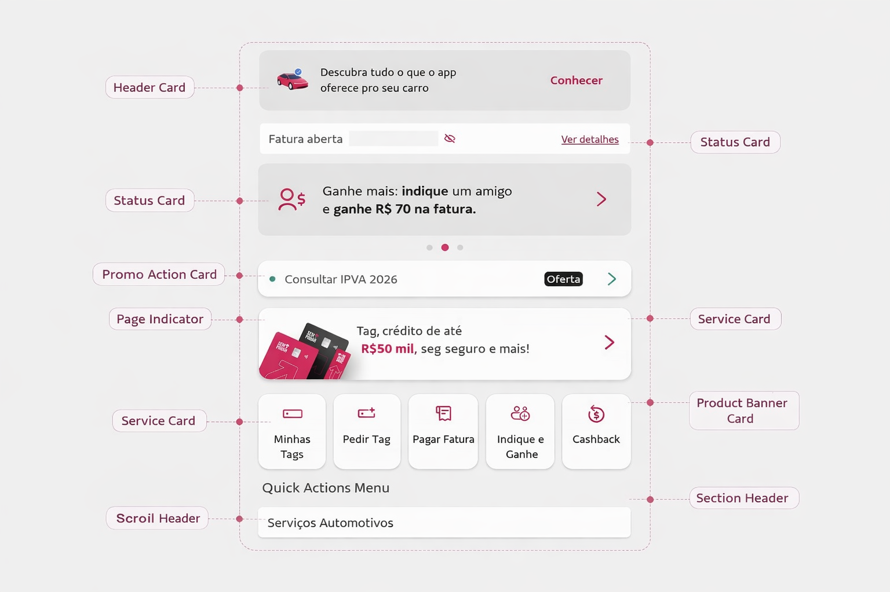
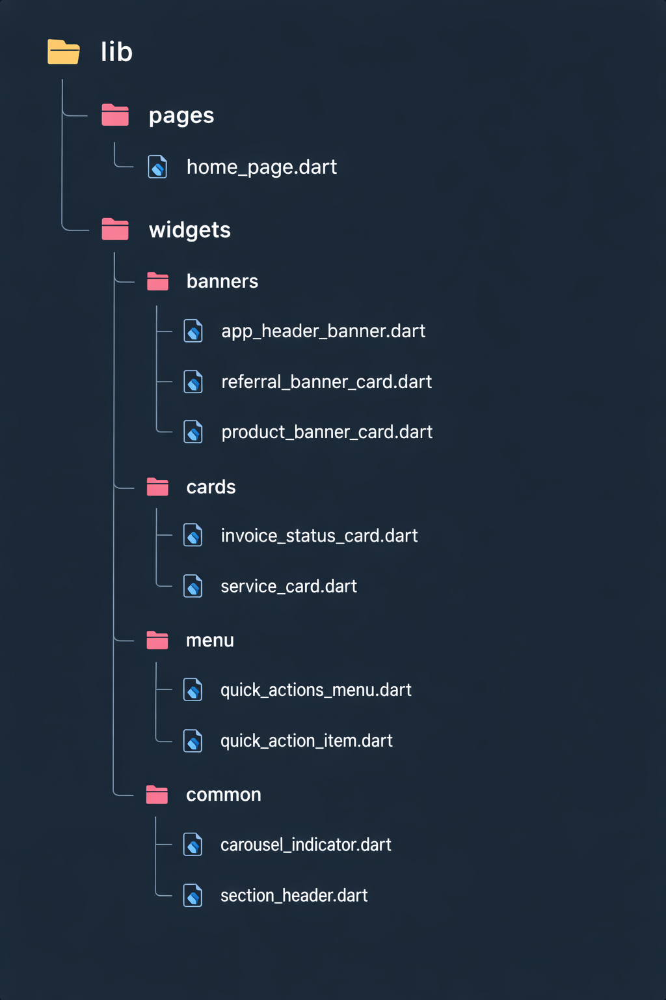

### Construção Incremental da Página Inicial em Flutter

Nesta etapa do desenvolvimento, iremos construir a **tela principal do nosso aplicativo**, tomando como referência estrutural a interface apresentada no aplicativo **Sem Parar**. O objetivo não é reproduzir visualmente o aplicativo original, mas **utilizar sua organização de componentes como inspiração didática** para compreender como uma interface moderna é composta em Flutter. A partir dessa análise, iremos montar uma tela equivalente organizada em **cards, banners, menus de ações rápidas e seções de serviços**, todos estruturados por meio de widgets como `Scaffold`, `Column`, `Row`, `Container` e `Card`. Essa implementação servirá como a **Home Page do nosso aplicativo**, permitindo demonstrar na prática como diferentes componentes de interface podem ser organizados de forma modular, reutilizável e escalável dentro de uma aplicação Flutter.

Para construir a **tela principal de forma incremental**, vamos dividir a interface em **componentes independentes**, seguindo princípios inspirados no **SOLID**, principalmente:

* **Single Responsibility Principle (SRP)** → cada componente tem uma única responsabilidade visual/funcional
* **Open/Closed Principle (OCP)** → componentes podem ser reutilizados e estendidos
* **Dependency Inversion (DIP)** → a tela principal depende de abstrações (componentes), não de implementações diretas

Assim, a **HomePage** será apenas um **orquestrador de componentes**, enquanto cada parte da interface será implementada como um widget independente.

### Decomposição arquitetural dos componentes

| Etapa | Componente             | Responsabilidade                                       | Elementos internos                                           | Papel na arquitetura             |
| ----- | ---------------------- | ------------------------------------------------------ | ------------------------------------------------------------ | -------------------------------- |
| 1     | **HomePage**           | Estruturar a tela principal e organizar os componentes | Scaffold, ScrollView, Column                                 | Componente de composição         |
| 2     | **AppHeaderBanner**    | Exibir o banner superior do aplicativo                 | Ícone, texto promocional, botão de ação                      | Componente de apresentação       |
| 3     | **InvoiceStatusCard**  | Mostrar o status da fatura do usuário                  | Texto de status, ícone de visibilidade, botão "ver detalhes" | Card informativo                 |
| 4     | **ReferralBannerCard** | Exibir promoção de indicação de amigos                 | Ícone, texto promocional, seta de navegação                  | Card promocional                 |
| 5     | **CarouselIndicator**  | Indicar a posição do banner no carrossel               | Pontos indicadores                                           | Componente de estado visual      |
| 6     | **ServiceCard**        | Exibir um serviço específico do app                    | Indicador de status, título do serviço, badge, seta          | Card de serviço                  |
| 7     | **ProductBannerCard**  | Apresentar produtos financeiros                        | Imagem, texto promocional, botão de navegação                | Banner de produto                |
| 8     | **QuickActionsMenu**   | Agrupar atalhos principais do aplicativo               | Grid ou Row de ações                                         | Menu de navegação                |
| 9     | **QuickActionItem**    | Representar uma ação rápida individual                 | Ícone + rótulo                                               | Componente reutilizável          |
| 10    | **SectionHeader**      | Identificar uma seção da tela                          | Título da seção                                              | Componente de organização visual |

Organização das pastas

Na prática do desenvolvimento em Flutter, é recomendável construir a interface **de baixo para cima**, iniciando pelos **componentes menores e mais reutilizáveis** e avançando gradualmente para os componentes maiores que organizam a tela. Isso ocorre porque a arquitetura do Flutter é baseada na **composição de widgets**, em que elementos simples são combinados para formar estruturas mais complexas. Dessa forma, primeiro criam-se componentes básicos, como itens de ação, indicadores ou cabeçalhos de seção; em seguida, desenvolvem-se componentes intermediários que agrupam esses elementos, como menus ou cards de serviço; e, por fim, implementa-se a **página principal**, responsável apenas por organizar e compor todos os widgets já existentes. Essa estratégia melhora a reutilização de código, a organização do projeto e a manutenção da aplicação, além de favorecer uma estrutura alinhada a boas práticas de modularização e aos princípios de responsabilidade única presentes no SOLID.

