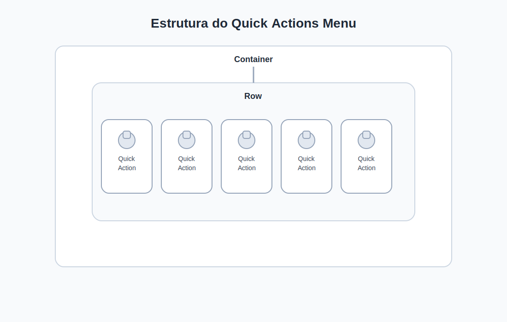

### Componente: QuickActionsMenu

Este componente representa o **menu de ações rápidas da tela principal**, onde cada opção corresponde a uma funcionalidade importante do aplicativo.

Exemplos de ações:

* Minhas Tags
* Pedir Tag
* Pagar Fatura
* Indique e Ganhe
* Cashback

Cada uma dessas opções será exibida utilizando o widget **`QuickActionItem`** criado anteriormente. A estrutura visual do componente pode ser representada da seguinte forma:



O `Row` é utilizado para **organizar os itens horizontalmente**, formando um menu de atalhos semelhante ao observado em muitos aplicativos móveis.

```dart
// lib/widgets/menu/quick_actions_menu.dart

import 'package:flutter/material.dart';
import 'quick_action_item.dart';

class QuickActionsMenu extends StatelessWidget {
  const QuickActionsMenu({super.key});

  @override
  Widget build(BuildContext context) {
    return Container(
      padding: const EdgeInsets.symmetric(vertical: 16),
      child: Row(
        mainAxisAlignment: MainAxisAlignment.spaceEvenly,
        children: const [

          QuickActionItem(
            icon: Icons.local_offer,
            label: "Minhas Tags",
          ),

          QuickActionItem(
            icon: Icons.add_circle_outline,
            label: "Pedir Tag",
          ),

          QuickActionItem(
            icon: Icons.payment,
            label: "Pagar Fatura",
          ),

          QuickActionItem(
            icon: Icons.group_add,
            label: "Indique",
          ),

          QuickActionItem(
            icon: Icons.monetization_on,
            label: "Cashback",
          ),

        ],
      ),
    );
  }
}
```

Este segundo componente introduz novos conceitos importantes:

* **Composição de widgets**
* **Reutilização de componentes**
* **Layout horizontal com `Row`**
* **Organização visual com `mainAxisAlignment`**
* **Separação de responsabilidades entre widgets**


