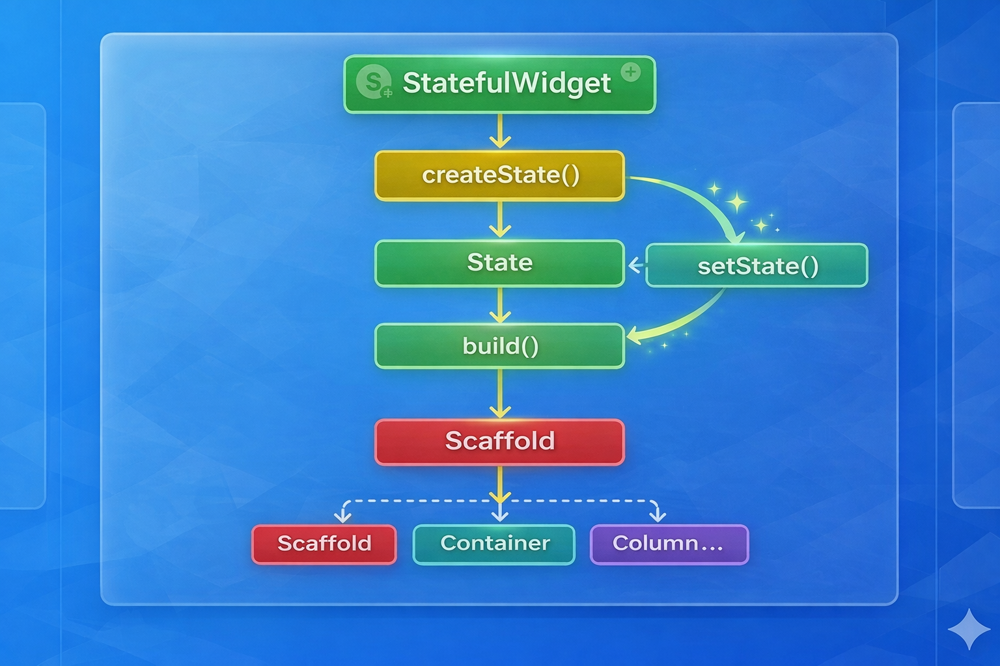
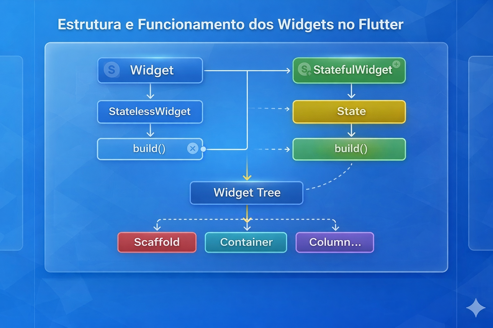

# StatelessWidget e StatefulWidget

#### Introdução

Vamos retomar o exemplo que é gerado automaticamente quando criamos um projeto Flutter utilizando o comando:

```bash
flutter create nome_do_projeto
```

Esse comando cria um projeto inicial contendo uma estrutura básica de aplicativo.

:::imgtext assets/images/futter_demo.jpg
A tela apresentada corresponde ao **exemplo padrão gerado pelo Flutter** ao criar um novo projeto. Ela demonstra a estrutura básica de um aplicativo utilizando um <code>StatefulWidget</code>, permitindo observar como o framework organiza a interface e controla o estado da aplicação.

Na parte superior encontra-se a <strong>AppBar</strong>, definida dentro do <code>Scaffold</code>, exibindo o título <strong>Flutter Demo Home Page</strong>.

No centro da tela está o corpo da interface, onde um <code>Column</code> centralizado apresenta dois textos: uma mensagem explicativa e o valor da variável <code>_counter</code>, que representa o <strong>estado atual da aplicação</strong>.
:::


----
Todo aplicativo Flutter começa pela função `main()`.

Ela é o **ponto de entrada da aplicação** e tem a responsabilidade de inicializar o framework Flutter e executar o **widget raiz** do aplicativo.

```dart
void main() {
  runApp(const MyApp());
}
```

A função `runApp()` recebe um widget e o insere na árvore de widgets da aplicação.

#### StatelessWidget

A classe `MyApp` utiliza um **widget imutável**, pois estende `StatelessWidget`.

Isso significa que, depois de construído, esse widget **não possui estado interno mutável**.

```dart
class MyApp extends StatelessWidget {
  const MyApp({super.key});

  @override
  Widget build(BuildContext context) {
    return MaterialApp(
      title: 'Flutter Demo',
      debugShowCheckedModeBanner: false,
      theme: ThemeData(
        colorScheme: ColorScheme.fromSeed(seedColor: Colors.deepPurple),
      ),
      home: const MyHomePage(title: 'Flutter Demo Home Page'),
    );
  }
}
```

#### Características de um StatelessWidget

Um `StatelessWidget`:

- não possui estado interno mutável
- sua interface depende apenas das **propriedades recebidas**
- sempre que algo precisa mudar, o widget precisa ser **reconstruído**

Em outras palavras:

> A interface de um StatelessWidget é **uma função das propriedades recebidas**.

#### Exemplos comuns de StatelessWidget

Alguns widgets comuns que são stateless:

- `Text`
- `Icon`
- `Container`
- `Row`
- `Column`

Esses widgets apenas **descrevem a interface**, mas não armazenam dados que mudam ao longo do tempo.


#### Quando precisamos de estado

Muitas interfaces precisam reagir a eventos como:

- cliques
- animações
- contadores
- mudanças de dados
- respostas de APIs

Nesses casos, precisamos de um **widget que possua estado mutável**.

Para isso o Flutter fornece o:

#### StatefulWidget

A classe `MyHomePage` utiliza um widget mutável porque estende `StatefulWidget`.

```dart
class MyHomePage extends StatefulWidget {
  const MyHomePage({super.key, required this.title});

  final String title;

  @override
  State<MyHomePage> createState() => _MyHomePageState();
}
```

Em Flutter, **estado** é qualquer dado que:
- pode mudar ao longo do tempo
- influencia o que é exibido na interface

Exemplos de estado:
- número de cliques
- texto digitado
- posição de um scroll
- resposta de uma API

O `StatefulWidget` **não armazena diretamente o estado**.

Ele apenas define:

- a **configuração do widget**
- qual classe irá controlar o estado

Isso acontece através do método:

```dart
createState()
```

que retorna a classe responsável por gerenciar o estado.

#### Classe State

A classe `_MyHomePageState` é responsável por:

- armazenar o estado
- reagir a interações do usuário
- reconstruir a interface

```dart
class _MyHomePageState extends State<MyHomePage> {

  int _counter = 0;

  void _incrementCounter() {
    setState(() {
      _counter++;
    });
  }

  @override
  Widget build(BuildContext context) {
    return Scaffold(
      appBar: AppBar(
        backgroundColor: Theme.of(context).colorScheme.inversePrimary,
        title: Text(widget.title),
      ),
      body: Center(
        child: Column(
          mainAxisAlignment: MainAxisAlignment.center,
          children: [
            const Text('You have pushed the button this many times:'),
            Text(
              '$_counter',
              style: Theme.of(context).textTheme.headlineMedium,
            ),
          ],
        ),
      ),
      floatingActionButton: FloatingActionButton(
        onPressed: _incrementCounter,
        tooltip: 'Increment',
        child: const Icon(Icons.add),
      ),
    );
  }
}
```

##### O que é setState()

O método `setState()` informa ao Flutter que o **estado foi alterado**.

```dart
setState(() {
  _counter++;
});
```

Quando `setState()` é executado:

1. o estado é atualizado
2. o Flutter chama novamente o método `build()`
3. a interface é reconstruída

Isso segue o modelo declarativo do Flutter:

:::tip
**Interface = função do estado atual**
:::


#### Por que o Scaffold fica na classe State

O `Scaffold` define a estrutura visual da tela:

- AppBar
- Body
- FloatingActionButton
- Drawer
- BottomNavigationBar

Como a interface precisa ser reconstruída quando o estado muda, o `Scaffold` precisa estar dentro do método `build()` da classe `State`.

Fluxo simplificado:


---

#### Acesso às propriedades do widget

A classe `State` pode acessar propriedades do `StatefulWidget` usando:

```dart
widget.propriedade
```

Exemplo:

```dart
title: Text(widget.title)
```

Aqui:

- `widget` é uma referência ao `MyHomePage`
- `title` é a propriedade definida nele

---



---

#### Comparação StatelessWidget vs StatefulWidget

| Característica | StatelessWidget | StatefulWidget |
|---|---|---|
| Estado interno | Não | Sim |
| Interface muda | Não | Sim |
| Uso comum | Layout estático | Interações e dados dinâmicos |

---

#### Regra mental importante

Uma forma simples de entender:

```
StatelessWidget → descrição da interface
StatefulWidget → configuração do widget
State → estado + lógica
```

#### Conclusão

O Flutter utiliza uma arquitetura baseada em **widgets imutáveis**.

Quando precisamos de dados mutáveis, utilizamos `StatefulWidget`, que separa:

- **configuração do widget**
- **controle do estado**
- **reconstrução da interface**

Essa separação permite ao Flutter:

- reconstruir interfaces rapidamente
- manter o estado consistente
- garantir alta performance.


:::warning
Evite colocar lógica de negócio dentro de Widgets.
:::

:::info
O prefixo `_` indica que a classe possui **escopo privado no arquivo Dart**.
:::

#### Exercício

:::imgtext ../assets/images/exercicio_stateful.png

A tela apresentada representa uma **estrutura típica de interface em Flutter construída a partir do widget `Scaffold`**, que funciona como a base organizacional de uma página no padrão Material Design. O `Scaffold` define regiões estruturais da interface, como a **AppBar (barra superior)**, o **Body (área principal de conteúdo)**, o **FloatingActionButton (botão de ação flutuante)** e a **barra inferior de navegação**. Essa organização permite separar claramente as responsabilidades visuais da aplicação, facilitando a compreensão do layout e a manutenção do código.

Na parte superior da interface encontra-se a **AppBar**, responsável por apresentar informações de navegação e ações globais da tela. Nela observamos o **ícone de menu (hamburger)** posicionado à esquerda, o **título da tela** centralizado e ícones de ação à direita, como **busca** e **menu de opções**. Esse componente faz parte da estrutura do `Scaffold` e é amplamente utilizado em aplicações Flutter para manter consistência com as diretrizes do Material Design.

No centro da tela está o **Body**, que contém o conteúdo principal da interface. Nesse exemplo, o corpo da aplicação apresenta um **Card**, utilizado para agrupar visualmente informações relacionadas. Dentro desse `Card` encontram-se um **ícone de coração**, um **texto descritivo ("Curtidas")**, o **valor numérico do contador** e um **botão de ação ("Curtir")**. Esses elementos são organizados verticalmente utilizando o widget `Column`, que permite alinhar e distribuir os componentes ao longo do eixo vertical.
:::

O valor exibido no centro do card representa o **estado da aplicação**, armazenado em uma variável numérica chamada `likes`. Sempre que o usuário pressiona o botão **Curtir** ou o **FloatingActionButton** localizado no canto inferior direito da tela, a função responsável incrementa esse valor e executa o método `setState()`. Esse método informa ao Flutter que o estado interno do widget foi alterado, fazendo com que o framework execute novamente o método `build()` e **reconstrua a interface com o novo valor atualizado**.

No canto inferior direito da tela encontra-se o **FloatingActionButton**, um componente característico do Material Design utilizado para representar a **ação principal da tela**. Nesse exemplo ele possui um ícone de "joinha" (`thumb_up`) e executa a mesma ação de incremento do contador. Sua posição sobreposta ao conteúdo principal reforça visualmente a importância dessa ação dentro da interface.

Na parte inferior da tela observa-se a **barra de navegação inferior**, implementada com `BottomAppBar`. Essa barra contém três ícones representando possíveis seções da aplicação: **home**, **favoritos** e **configurações**. Embora nesse exemplo esses ícones não possuam comportamento interativo, eles representam um padrão comum em aplicativos móveis, permitindo a navegação entre diferentes áreas da aplicação.

Como atividade prática, vocês deverão **refatorar o código desta tela**, da mesma forma que foi realizado anteriormente em outros exemplos da disciplina. O objetivo da refatoração é **identificar cada elemento estrutural da interface e modularizar o código**, separando responsabilidades em widgets menores e mais organizados. Durante esse processo, os estudantes deverão inserir **comentários explicativos no código**, identificando componentes como `Scaffold`, `AppBar`, `Body`, `Card`, `Column`, `FloatingActionButton` e `BottomAppBar`, reforçando a compreensão da arquitetura declarativa utilizada pelo Flutter, e por fim implementar o menu Hamburgues.

```dart 
import 'package:flutter/material.dart';

void main() {
  runApp(const MyApp());
}

class MyApp extends StatelessWidget {
  const MyApp({super.key});

  @override
  Widget build(BuildContext context) {
    return MaterialApp(
      title: "Exemplo StateFulWidget",
      debugShowCheckedModeBanner: false,
      theme: ThemeData(
        colorScheme: ColorScheme.fromSeed(seedColor: Colors.blue),
      ),
      home: const HomePage(),
    );
  }
}

class HomePage extends StatefulWidget {
  const HomePage({super.key});

  @override
  State<HomePage> createState() => _HomePageState();
}

class _HomePageState extends State<HomePage> {
  int likes = 0;

  void incrementarLike() {
    setState(() {
      likes++;
    });
  }

  @override
  Widget build(BuildContext context) {
    return Scaffold(
      appBar: AppBar(
        title: const Text("Exemplo StateFulWidget"),
        centerTitle: true,
        leading: const Icon(Icons.menu),
        actions: const [
          Padding(
            padding: EdgeInsets.symmetric(horizontal: 10),
            child: Icon(Icons.search),
          ),
          Padding(
            padding: EdgeInsets.symmetric(horizontal: 10),
            child: Icon(Icons.more_vert),
          ),
        ],
      ),
      body: Center(
        child: Card(
          elevation: 6,
          margin: const EdgeInsets.all(20),
          child: Padding(
            padding: const EdgeInsets.all(25),
            child: Column(
              mainAxisSize: MainAxisSize.min,
              children: [
                const Icon(Icons.favorite, size: 50, color: Colors.red),
                const SizedBox(height: 10),
                const Text("Curtidas", style: TextStyle(fontSize: 20)),
                const SizedBox(height: 10),
                Text(
                  "$likes",
                  style: const TextStyle(
                    fontSize: 36,
                    fontWeight: FontWeight.bold,
                  ),
                ),
                const SizedBox(height: 20),
                ElevatedButton(
                  onPressed: incrementarLike,
                  child: const Text("Curtir"),
                ),
              ],
            ),
          ),
        ),
      ),
      floatingActionButton: FloatingActionButton(
        onPressed: incrementarLike,
        child: const Icon(Icons.thumb_up),
      ),
      bottomNavigationBar: BottomAppBar(
        height: 60,
        child: Row(
          mainAxisAlignment: MainAxisAlignment.spaceAround,
          children: const [
            Icon(Icons.home),
            Icon(Icons.favorite),
            Icon(Icons.settings),
          ],
        ),
      ),
    );
  }
}

```