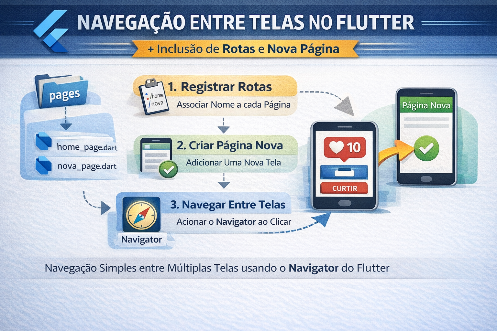

### Incluindo rotas

Nesta etapa, a aplicação será ampliada para incluir **navegação entre telas**. Até agora o aplicativo possui apenas uma página (`HomePage`). A partir de agora, será criada **uma segunda página**, permitindo demonstrar como um aplicativo pode possuir múltiplas telas e como o usuário pode navegar entre elas.

Para isso, será utilizado o conceito de **rotas (routes)** do Flutter. Uma rota representa uma **tela da aplicação**. O Flutter utiliza o componente **Navigator** para controlar a navegação, organizando as telas em uma espécie de **pilha**: quando uma nova página é aberta, ela é colocada no topo; quando o usuário retorna, a página atual é removida dessa pilha.

Primeiro será configurado o **registro de rotas no `MaterialApp`**, associando um nome a cada página da aplicação. Em seguida, será criada **uma nova página dentro da pasta `pages`**, mantendo a organização do projeto em camadas. Por fim, será adicionado um **componente de interação na tela principal**, que acionará o `Navigator` para abrir a nova rota.

Com essa modificação, o projeto passa a demonstrar **a estrutura básica de navegação em Flutter**, um conceito fundamental para o desenvolvimento de aplicativos com múltiplas telas.



Perfeito. Vamos em etapas.

**Passo 1: registrar as rotas no `MaterialApp`.**

Nesta etapa, vamos preparar o arquivo `main.dart` para que a aplicação reconheça mais de uma tela. A ideia é definir um nome para cada rota, permitindo que o Flutter saiba qual página abrir quando a navegação for solicitada. Por enquanto, mesmo antes de criar a nova tela, já podemos deixar a estrutura pronta para recebê-la.

No `MaterialApp`, usaremos principalmente duas propriedades: `initialRoute`, que define a rota inicial da aplicação, e `routes`, que registra o mapa de rotas disponíveis. A rota inicial será a tela principal, e depois adicionaremos a rota da nova página.

O `main.dart` ficará assim:

```dart
import 'package:flutter/material.dart';
import 'pages/home_page.dart';
// import 'pages/nova_pagina.dart';

void main() {
  runApp(const MyApp());
}

class MyApp extends StatelessWidget {
  const MyApp({super.key});

  @override
  Widget build(BuildContext context) {
    return MaterialApp(
      title: "Exemplo StatefulWidget",
      debugShowCheckedModeBanner: false,
      theme: ThemeData(
        colorScheme: ColorScheme.fromSeed(seedColor: Colors.blue),
      ),

      initialRoute: '/',

      routes: {
        '/': (context) => const HomePage(),
        // '/nova': (context) => const NovaPagina(),
      },
    );
  }
}
```

**Passo 2: — Criar a nova página**

Agora vamos criar **a segunda tela da aplicação**.
Ela ficará dentro da pasta **`pages`**, mantendo a organização da arquitetura usada no projeto.

Crie um novo arquivo:

```
lib/pages/nova_page.dart
```

```dart
import 'package:flutter/material.dart';

class NovaPage extends StatelessWidget {
  const NovaPage({super.key});

  @override
  Widget build(BuildContext context) {
    return Scaffold(
      appBar: AppBar(
        title: const Text("Nova Página"),
        centerTitle: true,
      ),

      body: const Center(
        child: Text(
          "Esta é a nova página da aplicação",
          style: TextStyle(fontSize: 22),
        ),
      ),
    );
  }
}
```

**Passo 3: — Registrar a nova rota no `MaterialApp`**

Agora que a nova página foi criada, o próximo passo é **registrá-la no sistema de rotas da aplicação**. Isso permite que o Flutter saiba qual página deve ser aberta quando a rota correspondente for chamada.

Para isso, voltamos ao arquivo **`main.dart`** e adicionamos a importação da nova página, além de incluir sua rota dentro da propriedade `routes`.

**Importação da nova página**

```dart
import 'pages/nova_page.dart';
```

**Registro da rota no mapa `routes`**

```dart
'/nova': (context) => const NovaPage(),
```

Isso significa que sempre que a aplicação navegar para a rota **`/nova`**, o Flutter irá construir o widget **`NovaPage`**.

**Passo 4: — Navegar para a nova página usando o `Navigator`**

Agora vamos adicionar **um botão na `HomePage`** para abrir a nova tela. Esse botão utilizará o **`Navigator.pushNamed`**, que é o método responsável por navegar para uma rota registrada no `MaterialApp`.

A ideia é simples: quando o usuário clicar no botão, o Flutter abrirá a rota **`/nova`**, que registramos no passo anterior.

### Alteração na `HomePage`

Abra o arquivo:

```
lib/pages/home_page.dart
```

Dentro do `body`, podemos adicionar um novo botão abaixo do card de curtidas.

```dart
Column(
  mainAxisSize: MainAxisSize.min,
  children: [

    LikeCard(
      likes: controller.likes,
      onCurtir: controller.incrementar,
    ),

    const SizedBox(height: 20),

    ElevatedButton(
      onPressed: () {
        Navigator.pushNamed(context, '/nova');
      },
      child: const Text("Abrir nova página"),
    ),

  ],
)
```

O comando:

```dart
Navigator.pushNamed(context, '/nova');
```

faz três coisas:

1. acessa o **Navigator da aplicação**
2. procura a rota chamada **`/nova`**
3. abre a página associada a essa rota

Quando isso ocorre, o Flutter **empilha a nova página sobre a atual**. Assim, o usuário pode retornar para a tela anterior usando o botão de voltar do sistema ou da `AppBar`.

--- 
### Exercício — Navegação pelo Menu Hamburger

Neste exercício vocês irão ampliar a aplicação desenvolvida em aula adicionando **duas novas páginas acessíveis pelo menu hamburger (Drawer)**.

Durante a aula já foram implementados:

* o **menu hamburger** no `Scaffold`
* o **sistema de rotas no `MaterialApp`**
* a navegação utilizando **`Navigator.pushNamed`**

Agora vocês deverão aplicar esses mesmos conceitos para permitir a navegação por meio do menu lateral.

### Tarefa

1. Criar **duas novas páginas** dentro da pasta `pages`.
2. Registrar as novas páginas no **mapa de rotas do `MaterialApp`**.
3. Adicionar **dois itens no `Drawer`**.
4. Fazer cada item do menu abrir sua página utilizando **`Navigator.pushNamed`**.

### Resultado esperado

Ao abrir o **menu hamburger**, o usuário deve visualizar duas novas opções. Ao selecionar cada uma delas, a aplicação deve navegar para a página correspondente.

### Entrega

Enviar no **Moodle**: o **projeto Flutter compactado (.zip)** contendo o código-fonte da aplicação.

---